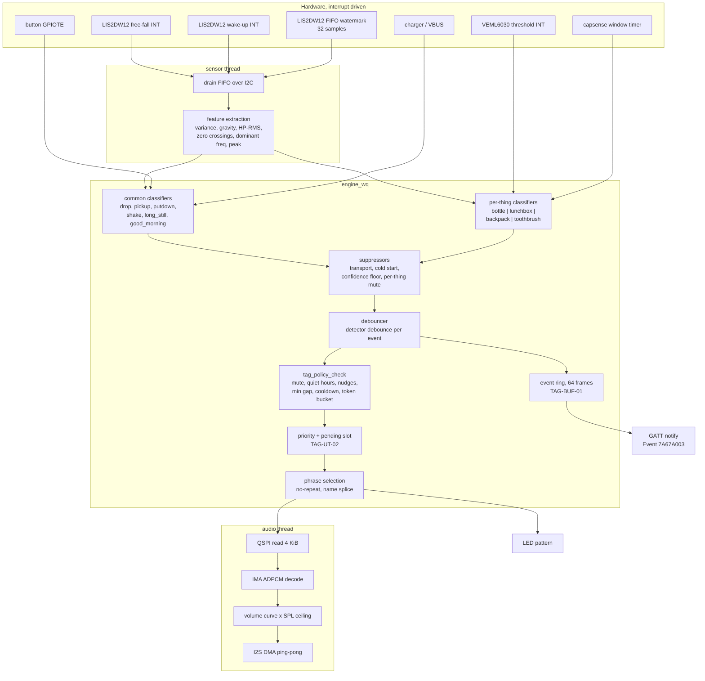
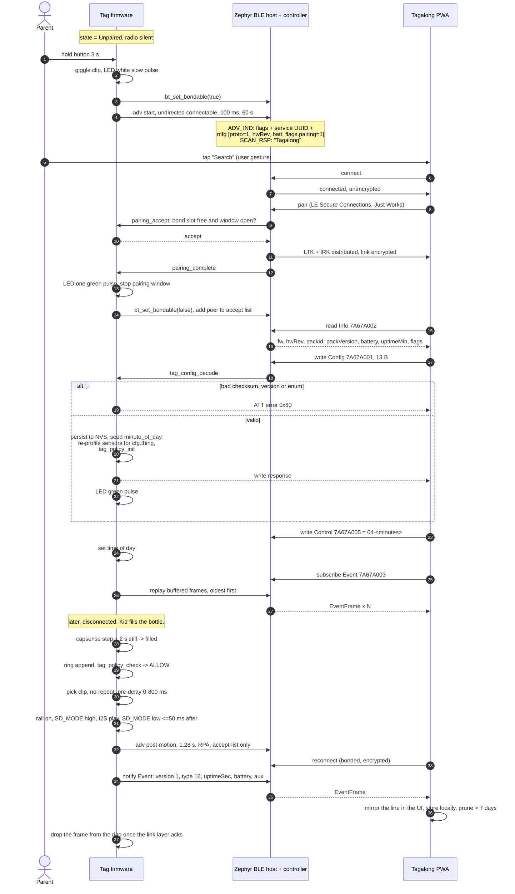

# Tagalong Tag — Firmware Architecture (nRF Connect SDK / Zephyr)

| | |
|---|---|
| **Status** | Accepted for build · 2026‑09‑22 |
| **Target** | nRF52840 (Raytac MDBT50Q‑1MV2), HW rev A |
| **Owner** | Firmware |
| **Authority** | `docs/00-product-brief.md` §5.1 · `docs/01-prd.md` §6 · ADR‑003, ADR‑004, ADR‑005, ADR‑007 · `docs/protocol/tag-protocol.md` · `docs/hardware/system-architecture.md` · `docs/hardware/power-budget.md` · `docs/privacy/threat-model.md` |
| **Companions** | `event-engine-spec.md` (detection and policy) · `content-pack-format.md` (flash layout) · `dfu-and-security.md` (boot chain) · `test-plan.md` (verification) |
| **Already built** | `firmware/include/tagalong_protocol.h`, `firmware/src/tagalong_protocol.c`, `firmware/include/tagalong_policy.h`, `firmware/src/tagalong_policy.c`, host tests in `firmware/tests/`. This document specifies the Zephyr application that wraps them. |

The tag has one job: notice what happened to the object it rides on, and say something funny about it within a beat — for 30 days on 150 mAh, with nothing leaving the device. Every structural decision below is traceable to one of those four constraints.

---

## 1. Design rules

| # | Rule | Why |
|---|---|---|
| FW‑R1 | **Nothing polls.** Sensors raise hardware interrupts; the MCU sleeps between them. | `power-budget.md` §4 lever 2: 2× battery life. |
| FW‑R2 | **The amp is off unless a clip is playing**, asserted low within 50 ms of the last sample. | `power-budget.md` §4 lever 1: 20× battery life. |
| FW‑R3 | **Pure C99 core, Zephyr shell.** Classifiers, policy and pack parsing take no Zephyr types and no wall clock; time is a `uint32_t` argument. | Every rule is testable on a laptop (`test-plan.md` §2). |
| FW‑R4 | **The wire format lives in exactly one place** — `tagalong_protocol.c`, byte‑identical to `app/src/transport/codec.ts`. | One contract, two implementations, shared vectors. |
| FW‑R5 | **No personal data in any log, ever** — see §13. | ADR‑002, `AGENTS.md`, PRV‑02/PRV‑16. |
| FW‑R6 | **Silence is a valid output.** A classifier below its confidence floor emits nothing. | `sensing-and-event-detection.md`: a false positive is worse than a missed event. |
| FW‑R7 | **The tag stores no phrase text.** The pack holds audio and indices only. | Smaller, faster, and there is nothing to read out of a stolen tag. |

---

## 2. Toolchain, targets and build configuration

| Item | Choice |
|---|---|
| SDK | **nRF Connect SDK, current LTS line** (Zephyr ≥ 4.0). The exact `west.yml` revision and toolchain SHA are pinned per release and recorded in the release manifest (`dfu-and-security.md` §8). No floating revisions. |
| Compiler | Zephyr SDK arm‑zephyr‑eabi, `-Og -g` dev / `-Os -g` release, `-Werror`, `-Wextra`, `-Wconversion` on `src/tagalong_*.c`. |
| Board | Out‑of‑tree board `tagalong_tag_nrf52840` (rev A). Overlays: `tagalong_tag_rev_a`, `tagalong_tag_rev_b`. |
| Dev target | `nrf52840dk/nrf52840` + `p0_rig.overlay` — the P0 rig from `02-roadmap.md` §4 (DK + LIS2DW12/VEML6030 breakouts + MAX98357A + 20 mm speaker on a printed puck shell). |
| Host target | `native_sim` for `ztest` suites; plain `gcc`/`clang` for the pure‑C suites already in `firmware/tests/`. |
| Build variants | `prod` (default), `dev` (logging + RTT + shell), `instrumented` (raw sensor streaming for corpus capture, `event-engine-spec.md` §11), `factory` (EOL test mode, `dfu-and-security.md` §8). Variants differ **only** by Kconfig fragment — never by `#ifdef` in application logic. |

```
firmware/
  CMakeLists.txt  prj.conf  Kconfig  VERSION  sysbuild.conf  west.yml
  boards/arm/tagalong_tag_nrf52840/        board, DTS, defconfig
  conf/  prod.conf  dev.conf  instrumented.conf  factory.conf
  include/  tagalong_protocol.h  tagalong_policy.h            (built)
            tagalong_engine.h  tagalong_pack.h  tagalong_audio.h
            tagalong_ble.h  tagalong_store.h  tagalong_ui.h  tagalong_power.h
  src/      tagalong_protocol.c  tagalong_policy.c            (built)
            main.c
            engine/    engine.c features.c cls_common.c cls_bottle.c
                       cls_lunchbox.c cls_backpack.c cls_toothbrush.c
            drivers/   accel.c als.c capsense.c battery.c charger.c
            audio/     player.c adpcm.c volume.c
            pack/      pack.c
            ble/       gatt.c adv.c pairing.c packxfer.c dfu_entry.c
            store/     store.c timekeeping.c event_ring.c
            ui/        button.c led.c
            sys/       power.c watchdog.c faults.c
  tests/    test_support.h test_protocol.c test_policy.c        (built)
            test_engine.c test_pack.c test_traces.c test_adpcm.c
            traces/                                             recorded corpus
  tools/    packbuild.py  tracereplay.py  vectors.json
```

Rule: `engine/`, `pack/` and `audio/adpcm.c` include **no** Zephyr headers. `drivers/`, `ble/`, `store/`, `ui/`, `sys/` are the only Zephyr‑aware modules. This is the same discipline the app uses to keep `content/` and `domain/` free of React.

---

## 3. Memory map

### 3.1 Internal flash (1 MB)

| Partition | Offset | Size | Contents |
|---|---|---|---|
| `boot_partition` | `0x000000` | 48 KiB | MCUboot, write‑protected at boot by ACL/FPROTECT |
| `slot0_partition` | `0x00C000` | 448 KiB | signed application (primary) |
| `slot1_partition` | `0x07C000` | 448 KiB | signed application (secondary, swap‑using‑move) |
| `storage_partition` | `0x0EC000` | 64 KiB | NVS: Zephyr `settings` (BLE bond keys, IRK), `TagConfig`, mute deadline, calibration, day counters |
| `provision_partition` | `0x0FC000` | 8 KiB | write‑once factory record: serial, hw rev, SPL calibration, sensor trims, MCUboot security counter |
| reserved | `0x0FE000` | 8 KiB | spare |

Expected application image ≈ 300–340 KiB (Zephyr + SoftDevice Controller peripheral‑only + our code), so `slot0` carries ≈ 25 % headroom. Rationale for two internal slots rather than a QSPI secondary is in `dfu-and-security.md` §2.

### 3.2 QSPI flash (W25Q128JVSIQ, 16 MiB, 64 KiB blocks)

| Region | Offset | Size | Contents |
|---|---|---|---|
| `pack_primary` | `0x000000` | 14,680,064 B (14 MiB) | active content pack; v1 EN uses 13,521,664 B (92.1 %) |
| `essentials` | `0xE00000` | 262,144 B | fallback mini‑pack, 8 kHz: 12 sound effects + one line per band × personality for `tap`, `low_battery`, `charging`. Never written in the field. |
| `name_clip_a` | `0xE40000` | 65,536 B | name clip slot A |
| `name_clip_b` | `0xE50000` | 65,536 B | name clip slot B — A/B so a re‑record is atomic |
| `pack_stage` | `0xE60000` | 524,288 B | PackXfer chunk staging + chunk bitmap (v1.1) |
| reserve | `0xEE0000` | 1,179,648 B | second language or pack growth |

`essentials` exists so that a corrupted or half‑written `pack_primary` degrades to a tag that still giggles and still says "charge me", instead of a silent brick. Detection and fallback are in `content-pack-format.md` §10.

### 3.3 RAM (256 KiB) — application budget

| Consumer | Bytes | Note |
|---|---|---|
| I²S TX ping‑pong (2 × 505 words) | 4,040 | one ADPCM block per buffer, §8 |
| QSPI read double buffer (2 × 4 KiB) | 8,192 | 16 ADPCM blocks per fetch |
| ADPCM decoder state | 32 | |
| Accel feature ring (8 blocks × 32 samples × 6 B) | 1,536 | 2.56 s of history for the drop/shake windows |
| `tag_policy_t` | 1,064 | `last_event_ms[256]` dominates |
| Engine per‑thing state | ≤ 512 | one union, only the configured thing is live |
| Event ring (64 × 8 B + head/tail) | 528 | TAG‑BUF‑01 |
| Thread stacks (§5) | 9,216 | |
| BLE host + controller (Kconfig, §9) | ≈ 34,000 | `CONFIG_BT_BUF_*`, ACL pool, SMP |
| **Application total** | **≈ 59 KiB** | leaves > 190 KiB unused; RAM is not a constraint on this design |

---

## 4. Boot sequence

```
MCUboot: verify slot0 signature → FPROTECT boot region → lock APPROTECT → jump
  app: clock init (LFXO 32.768 kHz, ±20 ppm)
       task watchdog start (8 s)
       NVS/settings load: config, mute deadline, calibration, day counters
       QSPI init → pack header read → CRC32 verify header → mount pack
         (fail → mount `essentials`, raise FAULT_PACK, LED TAG-LED-17)
       accel probe + self-test + FIFO/INT config for cfg.thing
       ALS / capsense arm per thing
       amp SD_MODE low, audio rail disabled
       BLE enable, settings_load for bonds, adv policy per §9.3
       engine init (cold-start window 20 s, no events emitted)
       state = Ship ? System OFF : (bonded ? Paired-active : Unpaired)
```

Boot to first possible utterance ≤ 400 ms, dominated by the pack header read and the accelerometer self‑test. The 20 s cold‑start window (`sensing-and-event-detection.md` §7) means the tag is silent while baselines settle, so boot latency is never audible.

`Ship` mode is `System OFF` with `nrf_gpio_cfg_sense_input` on the button and the charger‑detect pin: measured target ≈ 2 µA (TAG‑ST‑01). Exit is a full reboot, which is why a wake plays the ship‑wake sweep (TAG‑LED‑01) rather than trying to resume.

---

## 5. Execution model

Four application threads and one work queue. Everything that can be deferred is deferred, so the CPU is idle ≥ 98 % of the time even in `Active` (`power-budget.md` §1 note).

| Thread / queue | Prio | Stack | Wakes on | Work |
|---|---|---|---|---|
| `audio` | 4 (preempt) | 3,072 | I²S `TXPTRUPD`, play request | fetch QSPI → ADPCM decode → volume → fill next DMA buffer. Hard deadline 42.4 ms/buffer. |
| `sensor` | 6 (preempt) | 2,048 | accel FIFO watermark (GPIOTE→INT1), free‑fall/wake INT, ALS INT, capsense timer | drain FIFO, compute the block feature vector, push to the engine queue |
| `engine_wq` | 8 (preempt) | 2,560 | `k_work` from `sensor`, timers, button, charger, battery | classifiers → debouncer → `tag_policy_check` → phrase select → `audio` request; event ring append; LED request |
| `ui` | 10 (preempt) | 1,024 | button GPIO edge, `k_work_delayable` | gesture timing (§11), LED patterns via PWM |
| Zephyr sysworkqueue | 10 | 1,024 | GATT callbacks, adv timers, NVS writes | BLE plumbing, notification submission, settings commit |
| BT RX / TX | coop −8/−7 | SDK | controller | Zephyr/SoftDevice Controller internals |

Ordering guarantees that matter:

- `audio` outranks `sensor` and `engine_wq`, so a clip never glitches because a classifier ran long. A missed DMA deadline is a defect, not a tolerance (`test-plan.md` §5).
- `engine_wq` is a **single** work queue, so classification, policy and event‑ring writes are serialised without a mutex. `tag_policy_t` is touched from that queue only; the GATT write handler for `Control` posts work to it rather than mutating policy from the BLE context.
- The accelerometer ISR does nothing but `k_work_submit` — `sensor` does the I²C burst read, because a 32‑sample FIFO read at 400 kHz takes ≈ 4 ms and must not sit in an interrupt.

### 5.1 Inter‑module contracts

```c
/* sensor -> engine: one 32-sample block reduced to features (event-engine-spec.md §3) */
typedef struct {
    uint32_t t_ms;            /* monotonic, block end                      */
    int16_t  mean_g_mq10;     /* |a| mean, milli-g >> 10 fixed point        */
    uint16_t var_mq10;        /* variance of |a|                            */
    int16_t  gx, gy, gz;      /* gravity estimate, milli-g                  */
    uint16_t hp_rms_mq10;     /* RMS after 3 Hz high-pass                   */
    uint8_t  zero_cross;      /* sign reversals of the high-passed signal   */
    uint8_t  dom_freq_hz;     /* dominant frequency, 0 if none              */
    uint16_t peak_g_mq10;     /* peak |a| in the block                      */
    uint8_t  flags;           /* FREEFALL_SEEN | IMPACT_SEEN | CLIPPED      */
} tag_feature_block_t;

/* engine -> audio: what to play, resolved to flash locations */
typedef struct {
    uint16_t clip;            /* pack clip index                            */
    uint16_t name_clip;       /* spliced clip index, 0xFFFF = none          */
    uint16_t gain_q15;        /* volume curve x per-unit SPL ceiling        */
    uint16_t pre_delay_ms;    /* TAG-UT-03                                  */
    uint8_t  led_pattern;
} tag_play_req_t;
```

---

## 6. Drivers and devicetree

| Function | Part | Zephyr binding / approach |
|---|---|---|
| Accelerometer | LIS2DW12 | in‑tree `st,lis2dw12` on `i2c0` (TWIM, 400 kHz), `CONFIG_LIS2DW12_TRIGGER_OWN_THREAD=n` — we use our own `sensor` thread; FIFO, free‑fall, wake‑up and 6D configured through the driver's attribute API plus two raw register writes for FIFO watermark and free‑fall duration |
| Ambient light | VEML6030 | in‑tree `vishay,veml7700` driver (register‑compatible); a ~120‑line shim covers the ALS interrupt thresholds the driver does not expose. Behind `tagalong_als` so the alternate (TSL2591) is a file swap. |
| Capacitive level | nRF52840 COMP + `CSENSE` | **out‑of‑tree** `drivers/capsense.c` on `nrfx_comp`: relaxation oscillator gated by TIMER1 via PPI, edge count captured per 10 ms window, 8 windows averaged. No Zephyr driver exists for CSENSE mode; the file is ≈ 200 lines and has no Zephyr dependency beyond `nrfx`. |
| Audio out | MAX98357A | `nordic,nrf-i2s` (`i2s0`); `SD_MODE` on a GPIO: high = Left‑channel mode (> 1.4 V from the 1.8 V rail), low = shutdown |
| Audio rail | TPS61099 | GPIO enable, asserted 5 ms before `SD_MODE` and released 50 ms after the last sample |
| Content flash | W25Q128JVSIQ | `nordic,qspi-nor` + `jedec,spi-nor`, 25 MHz, `CONFIG_PM_DEVICE=y` → deep power‑down between reads |
| Battery | divider + SAADC | `zephyr,voltage-divider` on `adc`, divider enable on GPIO so it draws nothing while idle; fuel gauge in `drivers/battery.c` (voltage curve + coulomb estimate, §10.3) |
| Charger status | BQ25100 `/CHG`, VBUS sense | `gpio-keys`‑style edge interrupts; VBUS is also a `System OFF` wake source |
| Button | tactile under overmould | raw GPIO + GPIOTE edge, 20 ms debounce in software (TAG‑BTN‑*) |
| LED ring | 2 × side‑fire RGB | `pwm0` (6 channels, 1 kHz), gamma‑corrected 8‑bit, hard ceiling of 3 Hz on any pattern (TAG‑LED preamble) |
| Watchdog | nRF WDT | `CONFIG_WDT_NRFX` + Zephyr `task_wdt`, §12 |
| Clocks | LFXO 32.768 kHz ±20 ppm | `CONFIG_CLOCK_CONTROL_NRF_K32SRC_XTAL=y`, `..._ACCURACY_20PPM` |

**Sensor configuration is per‑thing** and is re‑applied whenever `TagConfig.thing` changes (E‑03). The table is in `event-engine-spec.md` §2; the driver layer exposes one call, `tag_accel_profile(thing)`.

---

## 7. The event engine

`event-engine-spec.md` is the normative specification. This is the pipeline and where each stage lives.



Two properties are worth stating explicitly because they are easy to lose in refactors:

1. **The ring is written before the policy runs.** Every emitted event is logged whether or not it is spoken (TAG‑EV‑02); only suppressed and nudge‑off events are neither emitted nor logged.
2. **`tag_policy_check` is pure.** It never mutates state; `tag_policy_commit` runs only when a clip actually starts. That is what makes the pending slot (TAG‑UT‑02) correct — a held event can be re‑checked 3 s later without having consumed a token.

---

## 8. Audio pipeline

| Parameter | Value | Source |
|---|---|---|
| Codec | IMA ADPCM, 4 bit/sample, mono, 256‑byte blocks (505 samples/block) | ADR‑003, `content-pack-format.md` §2 |
| Pack sample rate (v1 EN) | 12,000 Hz nominal | `content-pack-format.md` §2 — decision needed on ADR‑003, see §16 |
| I²S clocking | `MCKFREQ = 32 MHz / 21` (1,523,809 Hz), `RATIO = 128` → **LRCK 11,904.76 Hz** | nRF52840 I²S; −0.79 % pitch error = 14 cents, inaudible |
| 16 kHz build | same MCK, `RATIO = 96` → 15,873.0 Hz | a pack rate change is a one‑line `RATIO` change |
| Sample width | 16‑bit stereo frames, identical sample in both halves | works with MAX98357A in Left or (L+R)/2 mode |
| DMA buffer | 505 words = 2,020 B, two buffers, `TXPTRUPD` ping‑pong | exactly one ADPCM block per buffer → **no carry state in the decoder** |
| Refill deadline | 42.4 ms | `audio` thread at prio 4 |
| QSPI fetch | 4,096 B (16 blocks) double buffered | amortises QSPI command overhead |
| Loudness | clips normalised to −16 LUFS at build time, 30 ms fades baked in | PRD §6.13 |
| Volume curve | `gain_q15 = min(vol_curve[volume], spl_ceiling_q15)`; 101‑entry Q15 table in flash (202 B); `volume == 0` → LED only, amp never enabled | TAG‑UT‑05 |
| SPL cap | `spl_ceiling_q15` is a **per‑unit** constant written at EOL step 5 from the measured SPL | CMP‑01; makes ≤ 75 dB(A) @ 25 cm true on every unit, not just the golden sample |

Playback sequence, and the power discipline inside it:

```
play(req):
  enable audio rail            ; t+0
  prefetch 4 KiB from QSPI     ; overlaps rail settling
  SD_MODE = 1                  ; t+5 ms
  fill both DMA buffers, I2S START ; t+10 ms
  ... decode-on-TXPTRUPD until the clip (and any spliced name clip) ends ...
  5 ms digital ramp down, I2S STOP
  SD_MODE = 0                  ; <= 20 ms after the last sample
  disable audio rail           ; <= 50 ms after the last sample  (FW-R2)
  QSPI -> deep power-down
```

`pre_delay_ms` is applied before `enable audio rail`, so the rail is not powered during the randomised 0–800 ms wait (TAG‑UT‑03). For `drop` the delay is ≤ 300 ms and the QSPI prefetch starts immediately, because that moment must feel instant.

**Name splicing** concatenates segments in the player: `segment[0] → name clip → segment[1]`, with a 20 ms cross‑fade at each seam and the decoder re‑initialised per segment (each ADPCM block is self‑contained, so this is free). Details in `content-pack-format.md` §7.

---

## 9. BLE stack

Everything here implements `docs/protocol/tag-protocol.md` and ADR‑007 exactly. Where the protocol document and the threat model differ on characteristic permissions, §9.5 says so and §16 carries the amendment request.

### 9.1 Kconfig

```
CONFIG_BT=y
CONFIG_BT_PERIPHERAL=y
CONFIG_BT_OBSERVER=n
CONFIG_BT_CENTRAL=n
CONFIG_BT_MAX_CONN=1
CONFIG_BT_MAX_PAIRED=1
CONFIG_BT_ID_MAX=1
CONFIG_BT_DEVICE_NAME="Tagalong"
CONFIG_BT_DEVICE_APPEARANCE=0
CONFIG_BT_DEVICE_NAME_DYNAMIC=n

# Pairing: LE Secure Connections, Just Works (no display, no keyboard -> no MITM protection)
CONFIG_BT_SMP=y
CONFIG_BT_SMP_SC_PAIR_ONLY=y            # refuse legacy pairing outright
CONFIG_BT_SMP_SC_ONLY=n                 # Secure Connections Only needs authenticated pairing
CONFIG_BT_SMP_ALLOW_UNAUTH_OVERWRITE=n  # a second bond cannot displace the first
CONFIG_BT_BONDABLE=y                    # gated at runtime: bondable only in the pairing window
CONFIG_BT_FIXED_PASSKEY=n

# Privacy: resolvable private address, rotated every 15 min (ADR-007)
CONFIG_BT_PRIVACY=y
CONFIG_BT_RPA_TIMEOUT=900
CONFIG_BT_SCAN_WITH_IDENTITY=n

# Link
CONFIG_BT_CTLR_PHY_2M=y
CONFIG_BT_CTLR_DATA_LENGTH_MAX=251
CONFIG_BT_BUF_ACL_RX_SIZE=251
CONFIG_BT_L2CAP_TX_MTU=247
CONFIG_BT_GATT_AUTO_SEC_REQ=n           # the tag requires security, it does not request it
CONFIG_BT_ATT_PREPARE_COUNT=0           # no long writes: the longest payload is a PackXfer chunk

# Storage
CONFIG_BT_SETTINGS=y
CONFIG_SETTINGS_NVS=y

# Deliberately absent
# CONFIG_BT_DIS_SERIAL_NUMBER         - PRV-20: no per-device identifier over GATT
# CONFIG_BT_DEVICE_NAME_GATT_WRITABLE - nobody renames the tag over the air
# CONFIG_BT_GATT_CACHING              - no need, and one less linkable attribute
```

`CONFIG_BT_GATT_DYNAMIC_DB=y` is enabled for exactly one purpose: registering the SMP/DFU service on `Control 0x06` and unregistering it on reboot (`dfu-and-security.md` §4). The Tagalong service itself is a static `BT_GATT_SERVICE_DEFINE` table.

### 9.2 Advertising payloads

The protocol document specifies the name, the complete 128‑bit UUID list and 4 bytes of manufacturer data. Those do not fit one legacy advertising PDU, so:

| PDU | Contents | Bytes |
|---|---|---|
| `ADV_IND` | Flags `0x06` (LE General Discoverable, BR/EDR not supported) `3` · Complete list of 128‑bit service UUIDs `18` · Manufacturer data, company `0xFFFF`, `[proto=1, hwRev, battery, flags]` `8` | **29 / 31** |
| `SCAN_RSP` | Complete Local Name `"Tagalong"` | **10 / 31** |

`flags` bit0 = pairing window open. Nothing else in either PDU varies per device or monotonically (PRV‑25): no uptime, no counters, no sequence number. Advertising interval carries ±10 ms jitter. `battery` is the one drifting field; PRV‑24 asks for 10 % quantisation, which §16 carries as an open item because it changes what the app's chooser filter sees.

### 9.3 Advertising policy (ADR‑007, TAG‑PAIR‑01)

| Window | Trigger | Address | Interval | Filter | Duration |
|---|---|---|---|---|---|
| Pairing | button hold 3 s | RPA | 100 ms (160 units) | none — undirected connectable | 60 s or until bonded |
| Post‑motion | any wake‑up interrupt | RPA, rotated every 15 min | 1.28 s (2048 units) | accept‑list = the bonded peer | 30 min after the last motion |
| Otherwise | — | — | **off** | — | — |

Implementation notes: `bt_le_adv_start(BT_LE_ADV_CONN, ...)` for the pairing window with `bt_set_bondable(true)`; the post‑motion window uses `BT_LE_ADV_OPT_FILTER_CONN` with `CONFIG_BT_FILTER_ACCEPT_LIST=y` and `bt_set_bondable(false)`, so a stranger's connection attempt is refused by the controller and never reaches the host. An unbonded tag has an empty accept list and therefore does not advertise at all outside the pairing window — which is correct: an unpaired tag in a drawer is radio‑silent.

Finding a lost tag by radio is intentionally impossible (ADR‑007 consequence). PRV‑65's unwanted‑tracker field test is a release gate (`test-plan.md` §6.3).

### 9.4 GATT table

Service `7A67A000-1E5E-4B2C-9B8D-0C4F7E1D2A30`, characteristic UUIDs `7A67A001…7A67A006` with the same suffix — identical to `app/src/transport/uuids.ts`.

| Char | UUID | Properties | Permissions | Payload | Handler |
|---|---|---|---|---|---|
| Config | `7A67A001` | Read, Write | Read enc · Write enc | `TagConfig`, **16 B** | `tag_config_decode` → validate → NVS → re‑profile sensors → `Info.packId` unchanged |
| Info | `7A67A002` | Read | Read enc | `TagInfo`, 12 B | built on read from live state |
| Event | `7A67A003` | Notify | Read enc (CCCD write enc) | `EventFrame`, 8 B | ring replay on subscribe, oldest first |
| Battery | `7A67A004` | Read, Notify | Read enc (CCCD write enc) | `u8` percent | notify on a ≥ 1 % change, at most every 60 s |
| Control | `7A67A005` | Write | Write enc | `ControlOp`, 1–4 B | `tag_control_decode` → post to `engine_wq` |
| PackXfer | `7A67A006` | Write w/o response, Notify | Write enc (CCCD write enc) | v1.1 chunks | `content-pack-format.md` §11 |

Also exposed: **Device Information** `0x180A` with Model Number (`Tagalong`), Firmware Revision (`M.m.p`) and Hardware Revision only — **no Serial Number characteristic** (PRV‑20) — and **Battery Service** `0x180F` mirroring `7A67A004` so generic tooling works.

Static attribute count: 1 primary service + 6 characteristics (6 declarations + 6 values) + 3 CCCDs = 22 attributes, plus GAP, GATT, DIS and BAS.

### 9.5 Security posture per characteristic

The protocol document marks `Config`, `Control` and `PackXfer` as encrypted and is silent on the others; ADR‑007 says events are "delivered only to the bonded phone", and the threat model raises this as T‑11 with PRV‑18 and open question Q‑1.

**Firmware implements the stricter reading: every characteristic of the Tagalong service requires an encrypted link with the single bonded peer.** An unbonded or unencrypted peer receives `BT_ATT_ERR_AUTHENTICATION` on every read, write and CCCD write and is disconnected after 2 s. This is a superset of the protocol document's requirement — no app behaviour changes, because the app always bonds before touching the service. §16 carries the request to state it explicitly in the protocol document.

### 9.6 Bonding and pairing callbacks

| Rule | Implementation |
|---|---|
| Exactly one bond (ADR‑007, TAG‑PAIR‑02) | `CONFIG_BT_MAX_PAIRED=1`, `CONFIG_BT_SMP_ALLOW_UNAUTH_OVERWRITE=n`; `pairing_accept` returns `BT_SECURITY_ERR_PAIR_NOT_ALLOWED` when a bond exists or the pairing window is closed |
| Foreign bond attempt is visible | `pairing_failed` → red ×2 (TAG‑LED‑14) |
| Bond success is visible | `pairing_complete` → one green pulse (TAG‑LED, PRV‑22) |
| Pairing window closes on bond | `pairing_complete` stops the 60 s timer and switches to the post‑motion policy |
| Factory reset | `bt_unpair(BT_ID_DEFAULT, NULL)` + NVS wipe of config, mute, time and ring; content untouched (TAG‑PAIR‑05, CMP‑08) |

Connection parameters: peripheral preferred 30–50 ms interval, latency 0, supervision timeout 4 s while the app is configuring; after 10 s of link idleness the tag requests 200 ms / latency 4; after 60 s idle it disconnects (matching the `Connected → Active` edge in `system-architecture.md` §3).

Error handling is exactly the protocol document's: bad checksum, unknown version and out‑of‑range enums all return application error `0x80` from the write callback (`BT_GATT_ERR(0x80)`), which is what `tag_config_decode` already distinguishes via `TAG_ERR_CHECKSUM` / `TAG_ERR_VERSION` / `TAG_ERR_VALUE`.

---

## 10. Persistence

### 10.1 What is stored, and what is deliberately not

| Key | Store | Written when | Notes |
|---|---|---|---|
| BLE bond (LTK, IRK, peer identity) | `settings`/NVS | on bonding | cleared by factory reset |
| `TagConfig` (13 B) | NVS | on a valid `Config` write | survives reboot; re‑applied at boot |
| Mute deadline | NVS | on mute change | **cleared at boot** (TAG‑MU‑03) — stored only so a mute survives a brown‑out mid‑day is *not* a requirement; the record exists for the factory test path |
| Capsense baseline + empty/full span | NVS | leaky integrator, committed at most every 30 min | `event-engine-spec.md` §5.1 |
| Accel trims, SPL ceiling, serial, hw rev | `provision_partition` | factory, once | write‑once; `dfu-and-security.md` §8 |
| Day counters (`good_morning` fired, brush sessions, `low_battery` announced) | NVS | on change | reset at the tag's local midnight (TAG‑TIME‑02) |
| MCUboot security counter | `provision_partition` | MCUboot only | anti‑rollback |
| Event ring (64 × `EventFrame`) | **RAM** | continuously | snapshotted to NVS only on a critical‑battery shutdown |
| **Never stored** | | | kid names, any text, name clip *content* received from the app before v1.1, location, wall‑clock date, utterance transcripts |

NVS write budget: the W25Q is not involved; internal flash endurance is 10k cycles. Worst realistic case — 4 config writes/day, 48 baseline commits/day, 6 counter writes/day ≈ 58 records/day ≈ 21k records/year across a 64 KiB NVS with 16 sectors, which NVS's wear levelling spreads to well under 2k erase cycles/year per sector. Comfortable for a 5‑year support window.

### 10.2 Time keeping (no RTC — TAG‑TIME‑01/02/03)

`minute_of_day` is seeded by `TagConfig.timeOfDayMin` or `ControlOp 0x04` and advanced by the RTC counter off the LFXO. At ±20 ppm the drift is ≈ ±1.7 s/day at 20–30 °C and ≤ ±6 s/day across 0–45 °C, so the PRD's "≤ ±3 s/day" holds at room temperature and the sensing document's ±3 min/day tolerance holds everywhere. The app re‑sends the time on every connect, so real drift is bounded by connection frequency, not by the crystal.

`Time-unknown` (boot with no synced time): reactive events speak; `good_morning`, `left_behind` and `long_still` are suppressed; quiet hours cannot be evaluated and therefore do not block audio; the tap response double‑blinks first (TAG‑LED‑18). If the tag has not synced for **> 72 h**, it re‑enters `Time-unknown` rather than risk speaking at 3 a.m. (`sensing-and-event-detection.md` §2.6).

### 10.3 Battery estimate

Open‑circuit voltage curve for the cell chemistry (11‑point piecewise‑linear table, temperature compensated) plus a coulomb estimate that accrues the known cost of each utterance, advertising window and connection. The SAADC divider is enabled only for the measurement (200 µs) and read while the radio and amp are idle, because a 85 mA speaker transient moves the terminal voltage by tens of millivolts. Reported percent is monotonic while discharging: the fuel gauge never reports a rise unless `/CHG` is asserted (TAG‑BAT‑07 expects the app to smooth, but the tag should not create the jitter in the first place).

Thresholds with hysteresis: low at < 15 %, exit ≥ 18 %; critical at < 5 %, exit ≥ 8 % (TAG‑ST‑06/07). Below critical the tag is silent but stays connectable.

---

## 11. Power management, UI and state machine

`CONFIG_PM=y`, `CONFIG_PM_DEVICE=y`, `CONFIG_PM_DEVICE_RUNTIME=y`. Devices with runtime PM: QSPI (deep power‑down), I²S, ALS, the SAADC divider, PWM. The amp and audio rail are managed explicitly rather than through device PM, because the 50 ms deadline in FW‑R2 is too important to leave to a generic policy.

The state machine is `system-architecture.md` §3 and PRD §6.1 verbatim; firmware adds only the mapping:

| PRD state | Zephyr/hardware reality | Target current |
|---|---|---|
| Ship (TAG‑ST‑01) | `System OFF`, GPIO sense on button and VBUS | ≈ 2 µA |
| Idle | `System ON` sleep, RAM retained, RTC running, accel 12.5 Hz wake‑on‑motion, QSPI DPD, ALS shutdown | ≈ 12 µA |
| Active | accel at the per‑thing ODR, `sensor` waking on FIFO watermark (≈ 1.3 % CPU duty), capsense windows | ≈ 230 µA |
| Advertising | post‑motion window, 1.28 s | ≈ 45 µA |
| Pairing window | 100 ms undirected, 60 s | ≈ 2 mA |
| Connected | 30–50 ms interval | ≈ 180 µA |
| Speaking | rail + amp + QSPI + decode | ≈ 85 mA for ≈ 1.53 s |
| Charging | BQ25100 | ≈ 120 mA in |

Idle→Active is the wake‑up interrupt; Active→Idle is 30 s of stillness. The measured average utterance length from the shipped packs is **1.53 s** (`content-pack-format.md` §9), which confirms the 1.5 s figure the power budget assumes.

Button gestures (TAG‑BTN‑01…07) are timed in the `ui` thread with `k_work_delayable`: 20 ms debounce, single ≤ 400 ms, double within 500 ms, hold 3 s → pairing window, hold 10 s **while on the charger** → factory reset with an LED countdown (A‑03; off the charger a 10 s hold does nothing, which is the kid‑proofing). `tap` is produced **by the button only** — decision A‑01. The LIS2DW12 tap and double‑tap engines are configured but their interrupts are not routed to the engine in v1; using them would double‑fire `tap` and would false‑trigger in a school bag.

---

## 12. Watchdog and fault handling

| Layer | Mechanism |
|---|---|
| Hardware | nRF WDT, 8 s timeout, cannot be stopped once started |
| Software | Zephyr `task_wdt` channels for `audio` (2 s), `sensor` (4 s), `engine_wq` (4 s) and a BLE liveness channel (8 s). A channel that misses its window resets the chip. |
| Fatal errors | `k_sys_fatal_error_handler` → LED red slow blink (TAG‑LED‑17), amp off, increment a non‑personal fault counter in NVS, reset. **No coredump** (`CONFIG_DEBUG_COREDUMP=n`): a dump would contain decoded audio and, at v1.1, the name clip. |
| Recoverable faults | pack CRC fail → mount `essentials`; accel self‑test fail → sensor events disabled, button and BLE still work; QSPI absent → `essentials` from internal flash is not available, so audio is disabled and the LED fault pattern is the only response. Each is a distinct `FAULT_*` bit surfaced only through the LED and the factory test path. |
| Boot loop guard | MCUboot's test/confirm: an image that does not reach "BLE up and pack mounted" within 30 s is never confirmed, so the next boot reverts (`dfu-and-security.md` §5) |

The fault counter is never exposed over GATT or in advertising — a monotonic per‑device counter is exactly the linkable field PRV‑25 forbids.

---

## 13. Logging policy

**Production (`prod.conf`)**

```
CONFIG_LOG=n
CONFIG_PRINTK=n
CONFIG_ASSERT=n
CONFIG_SHELL=n
CONFIG_UART_CONSOLE=n
CONFIG_USE_SEGGER_RTT=n
CONFIG_DEBUG_COREDUMP=n
CONFIG_THREAD_NAME=n
```

There is no console, no shell and no transport for a log to leave the device. The UART and SWD pads are internal and SWD is closed by APPROTECT (`dfu-and-security.md` §6).

**Development (`dev.conf`)** enables `CONFIG_LOG` over RTT at `LOG_LEVEL_INF`, subject to three hard rules:

1. **No `%s` in any log statement under `src/`.** There is no string in this firmware that is safe to print: phrase text is not stored, and everything else that could be a string is a name. CI enforces this with a grep gate (`test-plan.md` §11).
2. **Log identifiers, not content.** `LOG_INF("evt=%u aux=%u dec=%u", type, aux, decision)` is fine; clip indices are fine (they are content, not personal); anything derived from a name clip, the name‑clip region or a `{{name}}` splice is not.
3. **Never log raw sensor traces outside the `instrumented` variant**, which is a separate build, never signed with the production key, and is physically identifiable by a distinct firmware version suffix (`+inst`).

The `instrumented` variant streams raw accelerometer, capsense and ALS samples over BLE for corpus capture (`event-engine-spec.md` §11). It is a development tool: it is loud about what it is, it refuses to run without a `tools/tracereplay.py` handshake, and it is excluded from the release manifest.

---

## 14. Pairing, config write and event notify



---

## 15. Gaps between this architecture and the C core already in the tree

`firmware/src/tagalong_policy.c` implements the utterance policy against `sensing-and-event-detection.md`. The PRD's §6.2/§6.3 requirements differ in several places. These are tracked as defects, not as documentation drift; `event-engine-spec.md` §§7–9 carry the normative tables.

| ID | Gap | Fix |
|---|---|---|
| FW‑GAP‑01 | `tag_event_debounce_ms()` serves as both the detector debounce and the utterance cooldown, using the sensing document's values; the PRD specifies different cooldowns (e.g. `pickup` 60 s not 2 s, `drop` 20 s not 3 s, `filled` 5 min not 60 s). | Split into `tag_event_detect_debounce_ms()` (sensing values, detector layer) and `tag_event_cooldown_ms()` (PRD values, policy layer). |
| FW‑GAP‑02 | `tag_event_is_nudge()` returns `{empty, left_behind, long_still}`; decision A‑08 defines nudges as `{long_still, good_morning, left_behind}`. | Follow A‑08. `empty` keeps its own 10‑min cooldown and stays reactive. |
| FW‑GAP‑03 | No rate‑limit bypass for `drop`/`tap`, and no separate 20/hour cap on `tap` (TAG‑UT‑01). | Add a second token bucket for `tap`; skip the main bucket for `drop` and `tap`. |
| FW‑GAP‑04 | No event priority and no pending slot (TAG‑UT‑02); `TAG_PENDING_HOLD_MS` is declared but unused. | Add `tag_event_priority()` and a single‑slot holder in the engine. |
| FW‑GAP‑05 | No pre‑speech delay (TAG‑UT‑03). | `drop` ≤ 300 ms, everything else uniform 0–800 ms from `tag_policy_rand`. |
| FW‑GAP‑06 | No probabilistic speak gate: `putdown` should speak ≈ 1 in 3, `sip` ≈ 1 in 2 (PRD §6.2). | `tag_event_speak_numerator/denominator()` consulted before the token bucket. |
| FW‑GAP‑07 | Battery gate is `battery <= 5`; the PRD says critical below 5 % with exit at ≥ 8 %, and low below 15 % with exit at ≥ 18 %. | Hysteresis state in the engine; policy takes a resolved `battery_state`. |
| FW‑GAP‑08 | `tag_policy_check` denies during quiet hours for all events, but control ops `01`/`02` must bypass quiet hours (TAG‑QH‑04, A‑09). | Control ops take a separate path that checks mute and critical battery only. |
| FW‑GAP‑09 | No per‑thing speech suppression (backpack suppresses `shake`/`putdown`, toothbrush suppresses `pickup`/`putdown`/`shake`, lunchbox suppresses `shake` and does not emit `long_still`, shoes/helmet suppress `putdown`). | `tag_thing_suppresses(thing, event)` in the engine, ahead of the policy. |
| FW‑GAP‑10 | `tag_policy_t.recent[]` stores clip indices **within the current cell**, so index 2 of `filled` wrongly excludes index 2 of `drop`. The app's equivalent stores globally unique line strings and has no such collision. | Store pack‑global clip ids; `tag_policy_pick_clip()` gains the cell's clipref base. `event-engine-spec.md` §9. |
| FW‑GAP‑11 | `last_event_ms[TAG_MAX_PER_HOUR_CAP > 0 ? 256 : 256]` is a no‑op ternary costing 1 KiB of RAM for 20 live event codes. | Index by dense event slot (20 entries, 80 B) using the same LUT the pack index uses. |

None of these block P0‑rig bring‑up (roadmap: firmware 0.1, October 2026); all are in scope for firmware 0.5 (December 2026, "full event set, quiet hours, mute, battery/LED states, buffer").

---

## 16. Assumptions and decisions recorded here

1. **Pack sample rate.** ADR‑003 specifies IMA ADPCM at 16 kHz. The shipped packs contain 2,052 lines / 1,592 distinct clips, which at 16 kHz is **16.98 MiB** — more than the entire 16 MiB flash. The v1 EN build is therefore specified at **12 kHz** (12.89 MiB, 92 % of the pack region). The format carries the rate in its header and the I²S change is one `RATIO` value, so this is reversible on a bigger flash part. **This needs an ADR‑003 amendment**; see the open questions in the delivery note.
2. **Characteristic permissions.** All Tagalong‑service characteristics require bonding and encryption (§9.5). This is stricter than the protocol document's table and matches ADR‑007 and PRV‑18.
3. **Advertising is split across `ADV_IND` and `SCAN_RSP`** (§9.2) because the protocol document's payload does not fit one 31‑byte PDU. No field is added or removed.
4. **Both MCUboot slots are in internal flash**, so a bad image reverts automatically. The QSPI region the earlier hardware document reserved for DFU staging is reassigned to PackXfer staging.
5. **`tap` comes from the button only** (decision A‑01); the accelerometer tap engines stay unrouted in v1.
6. **The tag stores no phrase text and no `TagConfig`‑adjacent strings.** The pack is audio plus integer indices.
7. **`essentials` mini‑pack** is a firmware‑side addition not named in any upstream document. It costs 256 KiB of QSPI and removes the "silent brick after a failed pack write" failure mode that PackXfer would otherwise introduce at v1.1.
8. **Per‑unit SPL calibration.** The ≤ 75 dB(A) cap is enforced by a per‑unit ceiling measured at EOL rather than a single firmware constant, because speaker sensitivity varies by more than the 10 dB margin we are holding.
