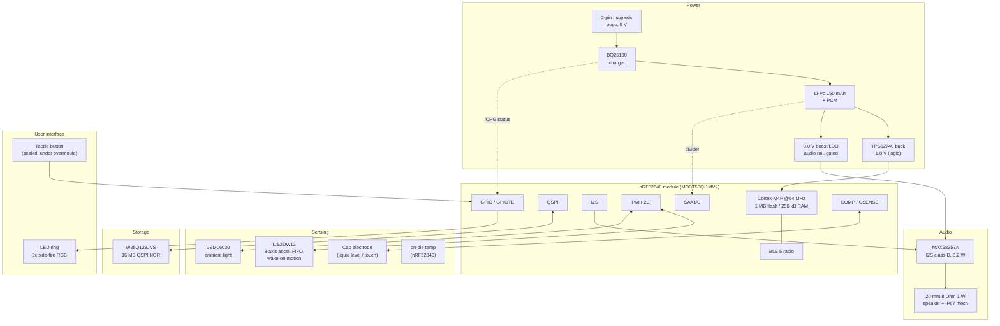
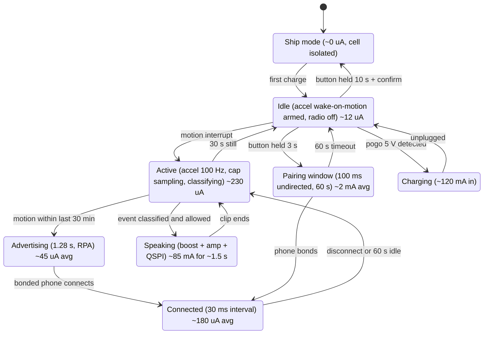

# Tagalong Tag — System Architecture (HW rev A)

Target: a ⌀38 × 12 mm sealed puck that senses what happens to the object it rides on, says something funny about it, and lasts a month per charge. Everything here is a starting point for a contract EE; alternates are listed so nothing is single-sourced by accident.

Authority: `docs/00-product-brief.md` §5.1, ADR‑003 (nRF52840 + pre-rendered audio), ADR‑004 (no microphone), ADR‑005 (sealed Li-Po), ADR‑007 (BLE privacy).

## 1. Block diagram

## 2. Subsystem choices

### 2.1 MCU / radio
| | Primary | Alternate A | Alternate B |
|---|---|---|---|
| Part | **Raytac MDBT50Q‑1MV2** (nRF52840 module, PCB antenna) | Fanstel BT840F | Bare nRF52840 QIAA + discrete RF |
| Why | Pre-certified FCC/IC/CE/MIC + Bluetooth SIG listing → removes ~$25–40k and 8–10 weeks of intentional-radiator testing from the schedule | Same silicon, second source | ~$1.60 cheaper at 10k, but costs the pre-certification |
| Cost @10k | $4.10 | $4.35 | $2.50 + cert |

Decision: **ship rev A on the module.** Revisit bare silicon only after 50k units, when the certification amortises.

Peripheral budget (nRF52840 has 48 GPIO; we use 14):
| Function | Pins |
|---|---|
| QSPI flash | 6 (CS, CLK, IO0–IO3) |
| I²S to amp | 3 (LRCK, BCLK, SDOUT) |
| Amp shutdown (SD_MODE) | 1 |
| I²C (accel + ALS) | 2 |
| Accel INT1 (wake-on-motion) | 1 |
| ALS INT | 1 |
| Cap electrode drive/sense | 1 (COMP + CSENSE) |
| Button | 1 |
| LED (2× via charlieplex or 1-wire) | 2 |
| Charger /CHG + battery divider enable | 2 |
| Battery sense | 1 (AIN) |

### 2.2 Motion sensing
| | Primary | Alternate |
|---|---|---|
| Part | **ST LIS2DW12TR** | Bosch BMA400 |
| Modes | 12/14-bit, 1.6 Hz–1600 Hz ODR, 32-level FIFO, free-fall, wake-up, 6D orientation, single/double tap in hardware | Similar, ~10 % lower idle current |
| Current | 50 nA power-down, **380 nA @12.5 Hz low-power**, 90 µA @100 Hz high-perf | 160 nA @25 Hz |
| Cost @10k | $0.62 | $0.78 |

Why it matters: free-fall, wake-up, tap and 6D are **hardware interrupts**, so the MCU sleeps through stillness. That is the single biggest lever on the 30-day target (see `power-budget.md`).

### 2.3 Capacitive sensing (liquid level / touch through plastic)
The bottle "filled / sip / empty" events come from a self-capacitance electrode reading the water column through the bottle wall.

- **Electrode:** 8 × 24 mm copper pour on the outer face of the flex tail that wraps inside the strap, oriented vertically so the capacitance tracks fill height. A hatched ground shield on the inner face rejects the user's hand.
- **Drive:** nRF52840 **COMP in capacitive-sensing mode** (relaxation oscillator, `CSENSE`) — no extra IC. Alternate: Microchip MTCH105 or an Azoteq IQS227D if noise immunity proves insufficient on metal bottles.
- **Wall thickness:** works through ≤2 mm of PP/Tritan. **Vacuum-insulated steel bottles block it** — for those, fill is inferred from the mass/tilt signature instead (see `sensing-and-event-detection.md` §3), and the app should say so honestly in the mount hint.
- **Calibration:** baseline captured at first power-on and slowly tracked (leaky integrator, τ ≈ 10 min) to absorb temperature and mounting drift.

### 2.4 Ambient light
**Vishay VEML6030** (I²C, 0.0036–140 klx, ~0.5 µA standby). Detects lunchbox lid open and "in a dark bag". Placed under a 1.5 mm light pipe in the housing. Alternate: ams TSL2591.

### 2.5 Audio path and the SPL budget
Chain: QSPI → ADPCM decode in RAM → I²S → **MAX98357A** (3.2 W class-D, 92 % efficient, I²S input, no codec needed) → **20 mm 8 Ω 1 W speaker** (PUI AS02008MR-3-R or CUI CMS-201-SP).

SPL maths, and why the cap is real:
- Speaker sensitivity: **82 dB SPL @ 0.1 W @ 10 cm** (typical for this class).
- We drive **0.25 W** peak → +4 dB → 86 dB @ 10 cm.
- Distance to 25 cm: −20·log₁₀(25/10) = **−8 dB** → **78 dB(A) @ 25 cm**.
- The IP67 acoustic mesh costs **−3 to −5 dB** → **73–75 dB(A) @ 25 cm**.
- Firmware clamps the digital gain so even `volume = 100` cannot exceed **75 dB(A) @ 25 cm**, against the EN 71‑1 / ASTM F963 limit of 85 dB(A) for a hand-held toy (and 65 dB(A) continuous). Verified per unit at EOL test, per `compliance-and-test-plan.md`.

The amp's `SD_MODE` pin is pulled low between utterances: quiescent drops from 2.4 mA to **<1 µA**. This is not optional — leaving the amp enabled alone would cost ~55 mAh/day and miss the battery target by 20×.

### 2.6 Content storage
**Winbond W25Q128JVSIQ**, 16 MB QSPI NOR, 1 µA deep power-down, 25 MHz read at 1.8 V. Holds the EN content pack (~7 MB, see `firmware/content-pack-format.md`), the name-clip region, and a DFU staging slot. Alternate: Macronix MX25L12835F.

### 2.7 Power
| Stage | Part | Note |
|---|---|---|
| Cell | 150 mAh Li-Po pouch, 3.7 V nominal, with PCM | 25 × 20 × 4 mm; IEC 62133‑2 + UN38.3 certified cell, **not** a coin cell (ADR‑005) |
| Charger | **TI BQ25100** | 250 mA programmable, 1.5 µA battery drain when unplugged, thermal fold-back, NTC input |
| Logic rail | **TI TPS62740** step-down, 1.8 V | 360 nA quiescent — the reason logic runs at 1.8 V rather than direct-from-battery |
| Audio rail | **TPS61099** boost to 3.0 V, enabled only while speaking | Keeps SPL constant as the cell sags from 4.2 → 3.4 V |
| Connector | 2-pin magnetic pogo, gold-plated, 5 V from a USB‑C charging puck | No exposed USB port on the tag (sealing + child safety) |
| Protection | Series Schottky + 6 V TVS on the pogo pins, NTC on the cell | Guards against a child shorting the pads or a wrong charger |

**Reverse-polarity and short-circuit on exposed pogo pads is a required test**, not a nice-to-have: two magnets will find a set of keys in a school bag.

### 2.8 User interface
- **One button** under the silicone overmould (no membrane seam): tap = "say hi", double-tap = mute 1 h, hold 3 s = pairing window, hold 10 s = factory reset.
- **LED ring**: two side-fire RGB LEDs behind a diffusing light guide. States below.

## 3. Power state machine

## 4. LED and button reference (must match the PRD and firmware)

| State | LED |
|---|---|
| Pairing window | Slow amber breathe, 1 Hz |
| Bonded / config received | One green pulse |
| Identify ("make it giggle") | 3 white flashes with the giggle clip |
| Low battery (≤15 %) | One amber blink every 30 s, only when moved |
| Charging | Amber breathe; solid green at 100 % |
| Muted | LED off entirely (a muted tag should look asleep) |
| Fault | 3 red blinks, then Idle |

| Gesture | Action |
|---|---|
| Single tap | Say a `tap` line |
| Double tap | Mute 1 hour (LED off) / unmute |
| Hold 3 s | Enter 60 s pairing window (giggle + amber breathe) |
| Hold 10 s | Factory reset: clear bonds + config, keep content |

## 5. Open hardware questions for the contract EE
1. Cap sensing through a **vacuum-insulated steel** bottle is not viable. Confirm the fallback (tilt + stillness inference) is good enough, or add a second SKU with an external float electrode.
2. Speaker port sealing at IP67 while keeping ≥73 dB(A): confirm mesh part (Gore or Saati) and measure the real insertion loss on a printed housing before DVT.
3. Whether a single side-fire light guide can carry the LED ring look, or whether it needs a moulded diffuser ring (cost +$0.35).
4. Antenna detuning when the tag is strapped to a **steel** bottle or sits against water. Needs a measured radiation pattern in all four mount positions; may require a 2 mm keep-out spacer in the strap.
5. Magnetic pogo puck: pick a supplier with a real IEC 62133 charging profile and confirm magnet pull force is below the small-part hazard threshold when the puck is detached.
