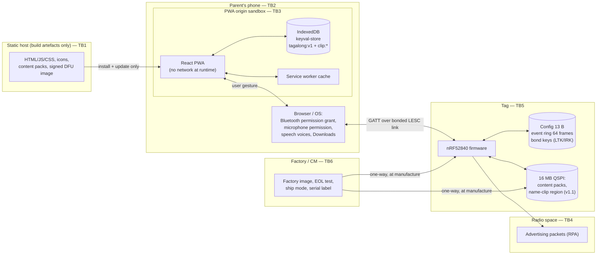

# Tagalong — Threat Model (v1.0)

| | |
|---|---|
| **Status** | Accepted for build · 2026‑09‑22 |
| **Owner** | Privacy engineering (this document) · founder approves |
| **Reviewers** | Firmware, App, EE (contract), Compliance, Legal, Content |
| **Method** | STRIDE per element, extended with **H** (harm to a child), plus abuse cases and attack trees |
| **Authority** | `docs/00-product-brief.md` §3, ADR‑002 (zero backend), ADR‑004 (no microphone), ADR‑005 (sealed cell), ADR‑007 (BLE privacy), `docs/protocol/tag-protocol.md`, `docs/01-prd.md` §6.11 |
| **Companions** | `data-inventory.md` (what exists), `compliance-matrix.md` (what regulators need), `privacy-policy.md` (what we tell parents) |
| **Review cadence** | At every gate (G0–G3), on any new data type or radio behaviour (roadmap §1 rule 3), and on any new ADR |
| **Build verified** | `app/src` as of 2026‑09‑22. `Status` columns describe the build on that date; re‑verify before quoting a status as evidence |

## 0. How to read this document

- **PRV‑nn requirements are normative.** Every mitigation named in this document lands on a numbered requirement in §8; every requirement has a named owner and a verification method. Nothing in this document is advice.
- **Status values** used throughout: `Implemented` (present in `app/src` or firmware today) · `Specified` (required by the PRD/ADRs, not yet built) · `Gap` (a source document requires it, the build does not do it yet) · `Proposed` (this threat model asks for it; needs an ADR or a protocol amendment before it is binding).
- **Risk scale.** Likelihood L1 rare / L2 possible / L3 likely × Impact I1 minor / I2 serious / I3 severe. *Severe* means physical or emotional harm to a child, or exposure of a child's identity or activity to somebody positioned to harm them. Score = L×I: 1–2 Low, 3–4 Medium, 6 High, 9 Critical. Residual risk is the score after the listed PRV requirements are in place and verified.
- Where this document and a source document appear to disagree, the source document wins and the disagreement is listed in §11 as an open item, not silently resolved here.

## 1. Scope and method

### 1.1 In scope

| Element | What we model |
|---|---|
| Companion PWA | Bundle integrity, browser storage, permissions (Bluetooth, microphone), export files, on‑screen exposure |
| Phone platform surface | What the browser/OS holds on our behalf: device permission grants, service‑worker cache, speech voices, downloads |
| BLE link | Advertising, pairing/bonding, GATT read/write/notify, observability by third parties |
| Tag | Firmware, stored configuration, event buffer, content packs, debug ports, DFU |
| Charger and power path | Exposed pogo pads, magnets, cell, thermal behaviour |
| Software supply chain | npm dependencies, build, release signing, DNS and static hosting |
| Hardware supply chain | Contract manufacturer, factory provisioning, content/firmware image handling, counterfeits |
| Household and social context | Siblings, shared phones, separated parents, hand‑me‑downs, resale, strangers near a school |

### 1.2 Out of scope, and why

| Out of scope | Reason |
|---|---|
| The phone's OS and browser internals | We inherit their security model. Data at rest is protected by platform encryption and the device lock; we say so plainly in the policy rather than pretending to add a layer we do not have. |
| A nation‑state adversary | Not a proportionate threat to a $29.99 talking bottle strap. Named here so nobody claims coverage we do not have. |
| Cloud breach, account takeover, credential stuffing, insider access to user data | **There is no server, no account and no user data in our possession** (ADR‑002). This whole class is designed out, not mitigated. |
| Location tracking infrastructure | The tag has no position source and no network (§7). |
| Microphone on the tag | Not present in v1 (ADR‑004). The v2 mic requires its own threat model before any hardware exists. |

### 1.3 The three properties we are defending

1. **A child's activity and identity stay in the household.** Nobody outside the home — including us — learns a child's name, age, routine, or what they did today.
2. **Only the parent's phone can change what the object says.** The tag's voice is a trusted voice in a child's life; the right to author it belongs to the bonded phone and to our reviewed content, and to nobody else.
3. **The tag cannot be turned into a way to find or follow a child.** Not by a stranger, not by a separated parent, not by us, not by a future product decision made carelessly.

## 2. Decomposition and trust boundaries



| # | Boundary | What crosses it | Primary controls |
|---|---|---|---|
| **TB1** | Our static host → every parent's phone | The app itself, and nothing else. No user data ever travels this way. | PRV‑45 … PRV‑52 (release integrity, DNS, headers, hosting logs) |
| **TB2** | The physical phone → people in the house | Everything the app shows on screen | Device lock (platform), PRV‑09, PRV‑11, PRV‑59 |
| **TB3** | PWA origin → other origins / other apps | Nothing at runtime. Only the export file the parent chooses to save or share. | PRV‑01 … PRV‑08 |
| **TB4** | Tag radio → anybody with an antenna | Advertising payload; GATT traffic on an encrypted link | PRV‑13 … PRV‑26 |
| **TB5** | Tag internals → a person holding the tag | Config, event buffer, content, bond keys | PRV‑27 … PRV‑36 |
| **TB6** | Factory → the product a child holds | Firmware, content, the cell, the label | PRV‑53, PRV‑54, PRV‑37 … PRV‑44 |

## 3. Assets

| ID | Asset | Where it lives | Why an adversary wants it | Worst case | Class |
|---|---|---|---|---|---|
| A‑01 | Child's first name (typed, optional) | `kids[].displayName`, IndexedDB | Identify a child; personalise an approach | A stranger can address a child by name | C3 |
| A‑02 | Name clip (audio of an adult or child saying the name) | `clip:<kidId>` blob, IndexedDB; tag QSPI region at v1.1 | Voice sample; name | Audio of a child leaves the household | C3 |
| A‑03 | Age band | `kids[].ageBand`; tag config byte 1 | Tailor grooming or marketing to a child's developmental stage | Age of a specific child inferred | C3 |
| A‑04 | Event log: what the object did, when | `events[]`, 7‑day cap; tag ring buffer (64 frames) | Infer a child's routine: when they leave, when they are at school, when the house is empty | A separated parent or stranger reconstructs a child's day | C3 |
| A‑05 | Which objects a child owns, nicknames | `tags[]` | Recognise a specific child's bottle; social‑engineering hook ("Bottle Buddy sent me") | A stranger names the child's toy back to them | C3 |
| A‑06 | Co‑presence signal (tag was near this phone at this time) | `tags[].lastSyncAt` | Weak presence inference | Coarse "was home at 18:04" | C2 |
| A‑07 | Tag identity as observed on air | Advertising payload, RPA | Follow one specific object between places | Longitudinal tracking of a child's bottle | C3 |
| A‑08 | The bond (LTK/IRK) | Tag NVM + phone Bluetooth stack | Authority to reconfigure the tag and to receive its events | Attacker owns the voice in a child's bedroom | C3 |
| A‑09 | Firmware signing key | Our release infrastructure — **never** on the tag, never at the CM | Ship arbitrary audio/behaviour to every tag in the field | Fleet‑wide compromise of a child's toy | C3 |
| A‑10 | Content packs (2,052 reviewed EN lines) | Repo, factory image, app bundle | Substitute unreviewed speech | The object says something harmful to a child | C3 |
| A‑11 | The PWA bundle and its origin | Static host, DNS | The PWA is the trust root: it holds mic and Bluetooth grants | Hostile app update reaches every household and persists offline | C3 |
| A‑12 | Parent's export file | The phone's Downloads / share target | One file with the whole household in it | Parent shares it somewhere public | C3 |
| A‑13 | The child's body and hearing | Physical | — | Burn, ingestion, hearing damage, strangulation | C3 |

Classes: **C0** public · **C1** internal/non‑personal · **C2** personal data about an adult · **C3** personal data about a child, or a child‑safety asset. Full field‑level treatment: `data-inventory.md`.

### 3.1 Assets we deliberately do not have

This table is the strongest control in the document. Each row is a whole category of breach that cannot happen to us.

| Asset a competitor holds | Tagalong | Consequence |
|---|---|---|
| User accounts, emails, passwords | None (ADR‑002) | No credential breach, no account takeover, no password reset phishing |
| Server‑side copy of family data | None | No cloud breach, no rogue‑admin access, no subpoena of usage data, no data broker sale |
| Location or a finding network | None (§7) | The product cannot be used to follow a child |
| Microphone on the tag | None (ADR‑004) | Nothing in a child's bedroom can listen |
| Camera | None | — |
| Analytics, crash reports, ad IDs | None | No third‑party SDK exfiltration, no profiling, no "anonymous" identifier that is not |
| Per‑device secret usable for tracking | None | A tag cannot be fingerprinted by us or anyone |
| A name string on the tag | None — the tag holds only an optional audio clip (v1.1) and a `nameClipPresent` bit | A stolen or resold tag reveals no name |

## 4. Adversaries

| ID | Adversary | Motivation | Capability | Access | Priority |
|---|---|---|---|---|---|
| ADV‑1 | **Separated or estranged co‑parent** | Monitor the child or the other parent; coercive control | Normal user; may have had the phone or the tag in hand | Physical access to phone, tag, or both, historically | **Highest consequence** |
| ADV‑2 | Older sibling or the child themself | Mischief, curiosity, mute the toy | No tools; physical access; the phone's passcode may be known | In the house | High likelihood, low consequence |
| ADV‑3 | Opportunistic stranger near a school | Curiosity, theft, in the worst case grooming | A phone, maybe a BLE scanner app | Within ~10 m, for minutes | High consequence, low likelihood |
| ADV‑4 | BLE hobbyist / security researcher | Publish a finding | nRF sniffer, Wireshark, patience | Within radio range | Medium — reputational |
| ADV‑5 | Thief / second‑hand buyer | Resale value | Holds the tag indefinitely | Full physical access | Medium |
| ADV‑6 | Malicious or careless insider at the CM | Cost‑down substitution, cloned units, leaked images | Factory tooling, our firmware images | Inside TB6 | High |
| ADV‑7 | Software supply‑chain attacker (npm, DNS, host account) | Mass compromise | Real skill, patient | TB1 | **Highest severity** |
| ADV‑8 | Data broker / marketplace scraper | Monetise children's data | Commercial | Only what we transmit — nothing | Neutralised by design |

## 5. STRIDE analysis

Legend: **S** spoof · **T** tamper · **R** repudiation · **I** information disclosure · **D** denial of service · **E** elevation of privilege · **H** harm to a child.

### 5.1 Companion PWA and phone storage (TB2, TB3)

| ID | Cat | Threat | Pre | Mitigations | Residual |
|---|---|---|---|---|---|
| T‑01 | I | A third‑party script, font, CDN or analytics SDK creeps into the bundle and exfiltrates a kid's name or the event log | L2×I3=**6** | PRV‑01, PRV‑02, PRV‑03, PRV‑47 | 2 |
| T‑02 | I | Speech preview is spoken by an **OS voice that synthesises in the cloud**, so phrase text (which can contain the child's name) leaves the phone via the platform | L2×I2=4 | PRV‑04, PRV‑05 | 1 |
| T‑03 | I | The export file lands in a shared Downloads folder or a cloud‑synced folder and is picked up by a backup service | L2×I2=4 | PRV‑06, PRV‑07, PRV‑08 | 2 |
| T‑04 | I | Anyone who can unlock the phone reads the child's name, age band and 7 days of activity in two taps | L3×I2=**6** | PRV‑09, PRV‑10, PRV‑11 (proposed app lock), policy disclosure | 4 — accepted, see §9 |
| T‑05 | I | Microphone permission, once granted for the name clip, is used at other times | L1×I3=3 | PRV‑12, PRV‑13 | 1 |
| T‑06 | T | A hostile browser extension or a second app on a rooted phone reads IndexedDB | L1×I3=3 | Origin sandbox (platform), PRV‑09; documented as a platform dependency | 3 — accepted |
| T‑07 | D | The browser evicts IndexedDB (iOS 7‑day eviction for non‑installed sites) and the family's setup vanishes | L3×I1=3 | PRV‑14, PRV‑15 | 1 |
| T‑08 | I | Dev logging or an error string leaks a name, a clip or an event payload | L2×I2=4 | PRV‑02, PRV‑16 | 1 |
| T‑09 | E | A cross‑site scripting bug turns into arbitrary speech and arbitrary storage reads | L1×I3=3 | PRV‑03, PRV‑47, React escaping, no `eval`, no `dangerouslySetInnerHTML` | 2 |
| T‑10 | I | Demo/simulated data is mixed with real data so a parent cannot tell what is actually stored about their child | L2×I1=2 | PRV‑17 | 1 |

### 5.2 BLE link (TB4)

| ID | Cat | Threat | Pre | Mitigations | Residual |
|---|---|---|---|---|---|
| T‑11 | I | **An unbonded peer connects and subscribes to `Event` (`7A67A003`), receiving the child's live activity and the replayed 64‑frame buffer** — the protocol table marks only `Config`, `Control` and `PackXfer` as encrypted | L2×I3=**6** | PRV‑18 (all Tagalong‑service characteristics bonded‑and‑encrypted; reject unbonded peers), PRV‑19 | 2 |
| T‑12 | I | An unbonded peer reads `Info` and learns firmware, pack and `nameClipPresent` | L2×I1=2 | PRV‑18, PRV‑20 (no serial‑number characteristic) | 1 |
| T‑13 | S | **Bond‑jacking**: an attacker in range wins the race during the 60 s pairing window and becomes the tag's owner (LESC *Just Works*, no display, no MITM protection) | L1×I3=3 | PRV‑21 (physical‑presence bond confirm, proposed), PRV‑22 (visible bond feedback), PRV‑23 (charger‑gated reset as recovery) | 2 |
| T‑14 | I | Passive observer links advertising packets across RPA rotations using the quasi‑static manufacturer‑data bytes (`proto`, `hwRev`, `battery`) and follows one child's bottle | L2×I3=**6** | PRV‑24 (quantise advertised battery), PRV‑25 (interval jitter, no other stable field), PRV‑26 (service UUID in the pairing window only — proposed) | 3 — see §7.2 |
| T‑15 | I | Observer infers presence and routine from the mere pattern of advertising (advertising only follows motion) | L2×I2=4 | PRV‑25, PRV‑34 (30‑min motion window is already a large reduction), accepted residual | 4 — accepted, §9 |
| T‑16 | T | Config write is replayed or forged to raise volume or disable quiet hours | L1×I2=2 | PRV‑18, protocol checksum + version validation (TAG‑PAIR‑04), firmware SPL clamp PRV‑38 | 1 |
| T‑17 | D | Radio jamming or flooding prevents setup | L1×I1=1 | Accepted; the tag works standalone once configured | 1 |
| T‑18 | E | `Control` op `0x06` (enter DFU) reached by a non‑bonded peer | L1×I3=3 | PRV‑18, PRV‑29 (signed images only), PRV‑30 (buttonless DFU requires the bonded link) | 1 |
| T‑19 | I | The app requests or displays RSSI / proximity, creating a de‑facto finder | L1×I3=3 | PRV‑27 (no ranging UI, no `watchAdvertisements`, no scanning) | 1 |
| T‑20 | S | A fake "Tagalong" peripheral impersonates a tag to the app and feeds it junk events | L1×I1=1 | zod/codec validation at the boundary (implemented), checksum, PRV‑28 | 1 |

### 5.3 Tag firmware and hardware (TB5)

| ID | Cat | Threat | Pre | Mitigations | Residual |
|---|---|---|---|---|---|
| T‑21 | E | Debug port (SWD) reachable on pads or internal test points; firmware and the name clip are read out | L2×I2=4 | PRV‑31 (APPROTECT enabled in production, hardware variant, verified at EOL), PRV‑32 (no SWD on user‑accessible pads) | 2 |
| T‑22 | T | Unsigned or downgraded firmware installed over DFU | L1×I3=3 | PRV‑29, PRV‑33 (monotonic version, anti‑rollback) | 1 |
| T‑23 | T | **`PackXfer` (v1.1) accepts any audio the phone sends — the protocol specifies CRC32, which is integrity only, not authenticity** | L2×I3=**6** | PRV‑34 (signed content packs, proposed for v1.1) | 2 after v1.1 |
| T‑24 | I | A resold or found tag still holds the previous child's name clip | L2×I3=**6** | PRV‑35 (factory reset zeroes the name‑clip region while keeping packs) | 1 |
| T‑25 | I | The tag keeps a long event history that outlives the household | L1×I2=2 | 64‑frame ring buffer only, cleared on reset (TAG‑BUF‑01, TAG‑PAIR‑05), PRV‑36 | 1 |
| T‑26 | S | Counterfeit "Tagalong" tags with an uncertified cell reach parents | L2×I3=**6** | PRV‑53 (serialised tray label + fw provenance), PRV‑54, brand enforcement | 4 |
| T‑27 | D | Battery drained by repeated triggering, so the tag is dead when a parent needs it | L2×I1=2 | Utterance rate limits TAG‑UT‑01, PRV‑36 | 1 |
| T‑28 | H | The tag speaks during quiet hours, or at a volume that startles a toddler | L2×I2=4 | PRV‑38 (hard SPL clamp), quiet hours + mute (TAG‑QH, TAG‑MU), PRV‑39 (close‑range SPL assessment) | 2 |

### 5.4 Charger and power path

| ID | Cat | Threat | Pre | Mitigations | Residual |
|---|---|---|---|---|---|
| T‑29 | H | Pogo pads shorted by keys or coins in a school bag → thermal event next to a child | L2×I3=**6** | PRV‑40 (short/reverse‑polarity test as a release gate), TVS + series Schottky + NTC (HW arch §2.7) | 2 |
| T‑30 | H | Charger magnets liberated and swallowed | L1×I3=3 | PRV‑41 (flux index below the ASTM F963 threshold; magnets not liberable after use‑and‑abuse) | 1 |
| T‑31 | H | Cell punctured, crushed, overheated in a hot car, or charged outside 0–45 °C | L2×I3=**6** | PRV‑42 (certified cell **and** pack, thermal fold‑back, charge inhibit outside 0–45 °C), packaging warnings | 2 |
| T‑32 | E | Data or debug path over the charge connector | L1×I2=2 | PRV‑32 (two pins, power only, no data, no SWD) | 1 |
| T‑33 | H | Charger cable in a cot or wrapped around a neck | L1×I3=3 | PRV‑43 (cable length + warnings; adult‑handled accessory) | 1 |
| T‑34 | H | A mount forms a loop that can pass over a child's head | L1×I3=3 | PRV‑44 (no closing loop; pull‑off before neck‑loop failure) | 1 |

### 5.5 Software supply chain and hosting (TB1)

| ID | Cat | Threat | Pre | Mitigations | Residual |
|---|---|---|---|---|---|
| T‑35 | T | **Hostile release**: compromised npm dependency, build machine, host account or DNS serves a modified PWA. The service worker then persists it offline, with the microphone and Bluetooth grants already given | L1×I3=3 → fleet‑wide | PRV‑45 (pinned lockfile, no install scripts), PRV‑46 (dependency review + audit in CI), PRV‑47 (CSP and security headers from the host, not only the meta tag), PRV‑48 (registrar lock, DNSSEC, hardware‑key 2FA), PRV‑49 (reviewed, reproducible, hash‑published releases), PRV‑50 (SW update and rollback playbook) | 2 |
| T‑36 | I | The static host's access log becomes a record of which households use a children's product, tied to IP | L3×I1=3 | PRV‑51 (host selection and log minimisation), PRV‑52 (disclosed honestly in the policy) | 2 |
| T‑37 | T | The signed DFU image published as a same‑origin asset is swapped | L1×I3=3 | PRV‑29 (the tag verifies the signature — host compromise is not sufficient), PRV‑49 | 1 |
| T‑38 | R | We cannot prove to a regulator or a journalist that a shipped build made no network calls | L2×I2=4 | PRV‑02 (automated zero‑network test), PRV‑49 (published build hash), PRV‑63 (third‑party audit) | 1 |

### 5.6 Hardware, factory and content supply chain (TB6)

| ID | Cat | Threat | Pre | Mitigations | Residual |
|---|---|---|---|---|---|
| T‑39 | T | Unreviewed or joke lines slip into the factory audio image | L2×I3=**6** | PRV‑55 (content build is hash‑pinned to reviewed packs), PRV‑56 (EOL test verifies the pack hash), PRV‑57 (two‑person content sign‑off) | 1 |
| T‑40 | E | The signing key is handed to the CM "to make flashing easier" | L2×I3=**6** | PRV‑58 (key never leaves our HSM; the CM receives signed artefacts only, under dual control) | 1 |
| T‑41 | T | Cost‑down substitution of the cell, the mesh or the magnet | L2×I3=**6** | PRV‑54 (approved‑vendor list, incoming inspection, golden‑sample audit, change control) | 2 |
| T‑42 | I | Factory test logs contain device identities that could later be correlated to customers | L1×I1=1 | PRV‑53 (test records hold no customer data; serials are not exposed on air or in GATT) | 1 |
| T‑43 | H | Tags leave the factory out of ship mode and arrive speaking, or hot | L1×I2=2 | Ship mode at ~50 % SoC (packaging §9), PRV‑56 | 1 |

### 5.7 Household and social context (abuse cases)

| ID | Cat | Threat | Pre | Mitigations | Residual |
|---|---|---|---|---|---|
| T‑44 | I/H | **ADV‑1 plants a tag on a child to monitor the other household** | L2×I3=**6** | §7.5: no payoff — no position source, no network, no remote read‑out (PRV‑27, PRV‑18). PRV‑59 (policy and support copy state plainly that a tag cannot locate a child) | 2 |
| T‑45 | I | ADV‑1 opens the app on a shared or previously shared phone and reads 7 days of a child's routine | L2×I3=**6** | PRV‑09 (platform lock is the control, documented), PRV‑10 (one‑tap log off; 7‑day cap), PRV‑11 (app lock — proposed v1.1) | 4 — accepted, §9 |
| T‑46 | H | A sibling mutes, hides or takes the tag; a toddler mouths it | L3×I1=3 | Physical safety set PRV‑37…PRV‑44; mute is visible in the app; the LED goes dark when muted | 2 |
| T‑47 | H | A stranger presses the button and the tag speaks; the child engages | L2×I2=4 | Content bans any line implying the tag can see, hear or locate (content guidelines §3); no name is spoken by a v1.0 tag (TAG‑NC‑01); PRV‑60 | 2 |
| T‑48 | I | A stranger learns "this child owns a Tagalong" and uses the brand as a social‑engineering hook | L2×I2=4 | PRV‑26 (proposed), PRV‑60, PRV‑61 (kid‑facing copy: the tag is a toy, it does not know things) | 4 — accepted, §9 |
| T‑49 | I | Hand‑me‑down or resale carries the previous child's clip or config | L2×I2=4 | PRV‑35, PRV‑23, PRV‑62 (the "forget this tag" sheet tells the parent how to wipe the tag itself) | 1 |
| T‑50 | H | A parent treats the event log as supervision and confronts the child ("the tag says you didn't brush") | L2×I2=4 | PRV‑61 (kid‑facing "obvious sign" copy, UK AADC standard 11, parental controls), content guidelines ban shame, nudges default **off** | 3 — accepted, §9 |

## 6. Attack trees

### AT‑1 — Find out where a specific child is, using Tagalong

```
GOAL: locate a child via the tag
├── Read a position from the tag ................ IMPOSSIBLE: no GNSS/UWB/Wi-Fi/cell (brief §5.1, ADR-004)
├── Ask a finding network ....................... IMPOSSIBLE: no network exists (ADR-002); no crowd-sourced radio
├── Ask our servers ............................. IMPOSSIBLE: there are no servers
├── Ask the parent's app remotely ............... IMPOSSIBLE: the app has no inbound interface, no push, no sync
├── Follow the radio in person
│   ├── Link RPAs across rotations via adv fields  MITIGATED: PRV-24, PRV-25 (see §7.2)
│   ├── Stay within ~10 m of the child            NOT A TECHNICAL ATTACK: physical following; the tag adds nothing
│   └── Deploy many static scanners (school gate, shop)
│        ├── needs a stable identifier ........... DEFEATED by RPA + PRV-24
│        └── needs the tag to be advertising ..... ONLY within 30 min of motion (ADR-007)
└── Take the phone and read lastSyncAt/events .... IN SCOPE as T-45, not location: coarse "near this phone at" only
```

### AT‑2 — Read the family's data

```
GOAL: obtain the child's name, age and activity
├── Compromise our cloud ........................ IMPOSSIBLE (no cloud)
├── Compromise the phone
│   ├── Unlock a shared/unlocked phone ........... T-45, residual accepted (PRV-09/10/11)
│   ├── Malicious extension or rooted device ..... T-06, platform dependency
│   └── Steal the export file .................... T-03 (PRV-06/07/08)
├── Compromise the PWA supply chain ............. T-35, highest severity, PRV-45…PRV-52
├── Sniff the BLE link .......................... needs the LTK; LESC encryption (PRV-18)
├── Connect as an unbonded peer and subscribe ... T-11 — THE GAP THIS DOCUMENT CLOSES (PRV-18)
└── Buy the tag second-hand ..................... T-24 (PRV-35): v1.0 tags hold no name at all
```

### AT‑3 — Make an object in a child's life say something harmful

```
GOAL: arbitrary or harmful speech near a child
├── Via the tag
│   ├── Ship malicious firmware ................. needs the signing key (PRV-58) + signature check (PRV-29)
│   ├── Push a malicious content pack ........... v1.1 PackXfer: CRC32 only → PRV-34 (signed packs)
│   ├── Corrupt the factory audio image ......... PRV-55, PRV-56, PRV-57
│   └── Speak arbitrary text over BLE ........... IMPOSSIBLE by design: pre-rendered audio only, no TTS on the
│                                                 tag (ADR-003); the protocol can only select an event line
├── Via the phone (the softer target)
│   └── Compromised PWA speaks arbitrary text via speechSynthesis ... PRV-45…PRV-49; this is why bundle
│                                                 integrity, not the radio, is our top severity
└── Via content authoring ....................... PRV-55, PRV-57, content guidelines §3/§6 review checklist
```

### AT‑4 — Silence, hijack or brick a tag

```
GOAL: deny the product or take it over
├── Bond-jack during the pairing window ......... T-13 (PRV-21 proposed, PRV-23 recovery)
├── Mute it physically (double-tap) ............. by design; visible in the app; a child in the house can do this
├── Drain the battery ........................... rate limits (TAG-UT-01), PRV-36
├── Brick it with bad firmware .................. PRV-29, PRV-33
├── Factory-reset someone else's tag ............ requires the charger + 10 s (PRD TAG-BTN-04); consequence is
│                                                 loss of config, never data disclosure
└── Jam the radio ............................... T-17, accepted; the tag keeps working standalone
```

## 7. BLE tracking and stalking analysis

This section exists because the single most predictable question about a small BLE device attached to a child is: *can this be used to follow my child?* The answer must be defensible in engineering terms, not marketing terms.

### 7.1 What a passive observer can see, by radio state

| Tag state | On air | Observable by a stranger | Duration |
|---|---|---|---|
| Ship mode | Nothing | Nothing | Until first charge |
| Idle (no motion for 30 min) | **Nothing** | Nothing | Most of a school day, most of the night |
| Post‑motion | Connectable adv, 1.28 s interval, **RPA rotated every 15 min**, payload `[proto, hwRev, battery, flags]` + Tagalong service UUID | "A Tagalong is within range"; a coarse battery figure | ≤ 30 min after motion |
| Pairing window | Undirected connectable adv, 100 ms, plus a giggle and an LED pulse | Same fields, plus the pairing flag; the tag also *announces itself audibly* | 60 s, button‑initiated |
| Connected | Encrypted GATT | Link exists; no payload | While the parent's app is in the foreground |

Note the deliberate asymmetry with a tracker: a tracker maximises the time it is observable, because that is how it is found. Tagalong minimises it, and the only time it is loudly discoverable, it giggles.

### 7.2 Linkability budget

RPA rotation is only as good as the rest of the payload. Manufacturer data carries `proto` (constant), `hwRev` (constant) and `battery` (drifts by roughly 1 % per day at the 30‑day target). Across a 15‑minute RPA epoch, `battery` is effectively constant. If one Tagalong is in range, an observer can trivially re‑link it across rotations; if several are, `battery` gives up to ~6.6 bits of separation — enough to distinguish two children's bottles in a classroom.

This is a real weakness in an otherwise sound design, and it is cheap to fix:

- **PRV‑24** — advertise battery in 10 % buckets (4 bits, ~10 distinct values), or omit battery from advertising entirely and expose it only over the bonded link (`Battery` characteristic and `Info` already carry it).
- **PRV‑25** — no other field may vary per device; add ±10 ms jitter to the advertising interval; do not expose uptime, counters, sequence numbers or a per‑device nonce in advertising.
- **PRV‑26 (proposed)** — include the 128‑bit Tagalong service UUID **only** in the pairing‑window advertisement. Outside that window the bonded phone resolves the RPA with the IRK and does not need the UUID, so omitting it removes the fleet‑level "a Tagalong is here" beacon that enables both product‑level profiling and the social‑engineering hook in T‑48. This changes `docs/protocol/tag-protocol.md` §Advertising and therefore needs an ADR, not a unilateral edit.

With PRV‑24/25 in place, two tags in the same room are not distinguishable on air, and a static scanner at a school gate learns only "some Tagalong passed", which is not a child‑tracking capability.

### 7.3 Why the tag is not a locator

A location tracker needs five things. Tagalong has none of them, and each absence is an architectural decision recorded in an ADR, not a configuration we could flip.

| Capability a locator needs | Tile / AirTag class | Tagalong | Recorded in |
|---|---|---|---|
| A position source (GNSS, UWB, Wi‑Fi scan, cell) | Yes, or inherited from the finding network | **None.** Sensors are accelerometer, one capacitive channel, ambient light, die temperature | brief §5.1, HW arch §2 |
| A network that reports position | Crowd‑sourced finding network, or cellular | **None.** The tag speaks to exactly one bonded phone, and that phone speaks to no server | ADR‑002, ADR‑007 |
| A persistent identifier that network can key on | Rotating but network‑resolvable identity | **None.** RPA rotated every 15 min, no serial, no name, no per‑device secret | ADR‑007, PRV‑24/25 |
| An owner query interface ("where is it?") | Map in an app | **None.** No map, no RSSI, no "hot/cold" finder, no last‑seen location | PRV‑27 |
| Stored position history | Yes | **None.** The tag stores 64 event frames with uptime deltas; the app stores 7 days of event types and times, no coordinates ever | protocol §EventFrame, `store.ts` |

ADR‑007 states the consequence explicitly: *finding a lost tag by radio is intentionally impossible in v1.* That is a feature. It is also why "Find my tag" must never be added as a small convenience; it would reverse the product's core privacy claim and pull it into the unwanted‑tracking regime below. Any such proposal requires a new ADR, a new threat model and a compliance re‑review (PRV‑64).

### 7.4 Unwanted‑tracking alerts (Apple/Google DULT) — out of scope, deliberately

The Apple/Google "Detecting Unwanted Location Trackers" specification, shipped in iOS 17.5+ and Android 6+, targets accessories that **participate in a crowd‑sourced location network**. Compliant accessories must, among other things, be findable by a victim, emit a sound when separated from their owner, and expose an identifier a victim can read out to trace the owner.

| Question | Position | Evidence |
|---|---|---|
| Is Tagalong in DULT scope? | **No.** It has no location network and reports no position to anyone. | §7.3 |
| Will it trigger unwanted‑tracker alerts on iOS/Android? | It should not: those alerts key on known locator accessories and network‑resolvable identities. **We verify empirically rather than assume.** | PRV‑65 |
| Do we implement DULT anyway? | No. A DULT accessory must expose a stable, readable identifier — the opposite of PRV‑24/25. Implementing it would make the tag *more* trackable, not less. | This section |
| What if we ever add tag‑to‑tag "tag talk" (v1.2, ADR‑008)? | That radio behaviour must be reviewed against this section before code, per roadmap §1 rule 3. The proposed rotating‑HMAC family key must not become a cross‑household identifier. | roadmap §6, PRV‑64 |

**PRV‑65** is a concrete test, not a paragraph: at DVT, three testers each carry a tag bonded to somebody else's phone for 72 hours with current iOS and Android builds, and we record that no unwanted‑tracker alert fires and no third‑party finding app reports the device. If an alert *does* fire, we treat it as a launch blocker and fix the advertising behaviour.

### 7.5 The planted‑tag abuse case (ADV‑1)

Assume the worst realistic case: a separated parent buys a tag, pairs it to their own phone, sets volume to 0 and quiet hours to the full day, and hides it in the child's backpack.

| Step | What they get |
|---|---|
| Tag is in the other household | Nothing. It is out of BLE range of their phone, so there is no link and no data. |
| They come within ~10 m (handover, school gate) | Their phone may reconnect and receive up to 64 buffered event frames: event types plus *uptime‑relative* timestamps. No coordinates, no absolute timeline unless their own app supplies the time base. |
| They want live location | Not available at any range. No position source, no network. |
| They want audio | Not available. No microphone (ADR‑004). |
| They want the child's name or history | The tag holds no name string; the app holds only what their own phone recorded. |

**Payoff: near zero, and it requires physical proximity they already have.** The behavioural residue (event frames since the last connection) is the only leak, it is bounded to 64 frames, and it is indistinguishable from what they would learn by looking at the child. We accept this residual (§9 R‑4) and add two controls: PRV‑59 (support and policy copy state plainly that a tag cannot locate a child, so a worried parent gets a truthful answer from the first search result) and PRV‑62 (a found tag can be neutralised by any adult with the charger — reset clears the bond).

We also reject the seductive "improvement" of making a planted tag announce itself periodically: it would nag in every normal household, drain the battery, and defeat quiet hours, for an abuse case with no payoff. The LED flash that accompanies every utterance (PRD A11Y‑10/TAG‑UT‑06) already means a volume‑0 tag is visually, not invisibly, active.

### 7.6 The stranger near a school

| Attempt | Result |
|---|---|
| Scan for BLE devices | "A Tagalong is here" during the 30 min after motion; no name, no age, no identity (PRV‑24/25/26) |
| Connect and read | Rejected: bonded, encrypted link required for every Tagalong characteristic (PRV‑18) |
| Press the button | The tag says a line. Content guidelines §3 forbid any line implying the tag can see, hear or know where the child is; v1.0 tags speak no name (TAG‑NC‑01) |
| Hold the button 3 s | Pairing window opens, but a bonded tag rejects a foreign bond (red ×2, TAG‑BTN‑03) |
| Hold the button 10 s | Nothing — reset needs the charger (TAG‑BTN‑04/05) |
| Take the tag | A $29.99 loss and no data. The parent forgets it in the app; the tag is useless without the bond |

## 8. Requirement register

Every requirement is written so an engineer can implement it and a tester can fail it. Owners: **App** = app engineering · **FW** = firmware · **EE/ME** = contract electrical/mechanical · **Rel** = release engineering · **Compl** = compliance · **Content** = content lead · **Legal** = outside counsel · **Ops** = operations.

### 8.1 App, phone storage and permissions

| ID | Requirement | Status | Verification | Owner |
|---|---|---|---|---|
| PRV‑01 | The running app makes no request to any origin other than the one it was served from. No `fetch`, `XMLHttpRequest`, `WebSocket`, `sendBeacon`, image beacon, dynamic `import()` of a remote URL, web font, or third‑party script. | Implemented (no such call exists in `app/src`) | Code review + PRV‑02 | App |
| PRV‑02 | CI fails the build on any cross‑origin request literal or runtime request. A Playwright test loads every route with request interception and asserts that the set of non‑same‑origin requests is empty; a static check rejects `http(s)://` literals outside comments and `<link rel=stylesheet>` to a remote host. | **Gap** — required by PRD X‑02, no such test exists | The test itself, run in `pnpm check` | App |
| PRV‑03 | CSP as in `index.html` (`default-src 'self'`, `connect-src 'self'`, `object-src 'none'`, `form-action 'none'`), no `eval`, no inline `<script>`, no `dangerouslySetInnerHTML`. | Implemented | Header/meta assertion in the same test as PRV‑02 | App |
| PRV‑04 | Speech previews use **only** voices whose `localService` is `true`. If the device offers no local voice the app stays silent and says why; it never falls back to a network voice, because a network voice would send the phrase text — which can contain the child's name — to the platform vendor. | Implemented (`lib/speech.ts`: `pickLocalVoice`, `canSpeak`, `speechUnavailableReason`) | Unit test over a stubbed voice list including a `localService: false` voice; visual check of the unavailable copy | App |
| PRV‑05 | Standing guard on PRV‑04: if any future build ever permits a non‑local voice, `{{name}}` must resolve to the band fallback (`friend`/`amigo`/`legend`) rather than the typed name, and the parent must be told before the first preview. | Proposed (guard; not needed while PRV‑04 holds) | Unit test; review at every gate | App |
| PRV‑06 | Export is a single file the parent explicitly asks for, saved through the browser/OS; the app never uploads it and never retains a copy. Filename and schema are versioned. | Implemented (`lib/exportData.ts`) | Manual + unit test on `buildExport` | App |
| PRV‑07 | The export screen states, before the download, exactly what the file contains and that audio clips are excluded, and warns that the file is unencrypted. | Partially implemented (the Privacy Center footer says clips are excluded; the unencrypted warning is missing) | Copy review against `privacy-policy.md` §Privacy Center copy | App |
| PRV‑08 | Export and clip playback use object URLs that are revoked after use; no blob URL is left resolvable. | Implemented (`exportData.ts`); **Gap** in `KidEditor.playClip` when playback never ends (`onended` only) | Code review | App |
| PRV‑09 | The app declares, in the Privacy Center and in About, that on‑device data is protected by the phone's lock and encryption, and that anyone who can unlock the phone can read it. | Partially implemented | Copy review | App |
| PRV‑10 | Activity logging is a single toggle that stops new writes immediately, and "Clear activity" deletes every event. Retention is hard‑capped at 7 days, enforced on app start and on every insert. | Implemented (`settings.eventLogEnabled`, `pruneEvents`, `clearEvents`) | `store.test.ts` — assert prune on insert and on rehydrate | App |
| PRV‑11 | A biometric/passcode gate (platform `WebAuthn` or the Capacitor equivalent) protects the Privacy Center, the Kids screen and export. | Proposed for v1.1 | Manual | App |
| PRV‑12 | Microphone access is requested only from the explicit "Record the name" gesture, the stream's tracks are stopped in every exit path including error and timeout, and no `MediaRecorder` exists outside that flow. | Implemented (`lib/clips.ts` stops tracks in `onstop`/`onerror`) | Code review; test the timeout path | App |
| PRV‑13 | No other media or sensor API is used: no camera, no geolocation, no `DeviceOrientation`/`DeviceMotion`, no `NetworkInformation`, no `Notification`, no background sync, no `navigator.bluetooth.requestLEScan`. | Implemented | Static check in the PRV‑02 test | App |
| PRV‑14 | The app requests persistent storage (`navigator.storage.persist()`) inside the first user gesture that saves a kid or a tag, and tells the parent when the browser declines. | Implemented (`lib/persistence.ts`, called from `addKid`/`addTag`) | Unit test with a stubbed `navigator.storage`; manual on iOS Safari | App |
| PRV‑15 | The app shows whether storage is protected, offers to ask the browser again, and on iOS Safari outside the Home Screen explains the ~7‑day eviction rule. | Implemented (Privacy Center "Keeping your data safe"; `isIosSafari`, `isStoragePersisted`) | Manual on iOS Safari installed and not installed | App |
| PRV‑16 | `console.*` is stripped from production builds; no log statement anywhere may include a name, a clip, an event payload, a device id or an export body. Error copy never contains device identifiers. | Partially implemented (`describeTransportError` is clean; the production strip is not configured in `vite.config.ts`) | Grep‑based lint rule + build inspection | App |
| PRV‑17 | Simulated tags and demo activity are visibly marked as demo everywhere and are counted separately from real data in the Privacy Center inventory. | **Gap** — PRD E‑16 requires separate counting; `privacyInventory()` counts all tags and events together | `selectors.test.ts` | App |

### 8.2 BLE link and protocol

| ID | Requirement | Status | Verification | Owner |
|---|---|---|---|---|
| PRV‑18 | **Every characteristic of the Tagalong service — `Config`, `Info`, `Event`, `Battery`, `Control`, `PackXfer` — requires an encrypted link with the single bonded peer.** An unbonded or unencrypted peer receives "Insufficient Authentication" and is disconnected after 2 s. Standard Device Information and Battery services are likewise gated, or omitted entirely in production. | **Gap** — ADR‑007 requires bonded‑only event delivery; the protocol table marks only `Config`/`Control`/`PackXfer` encrypted. Needs a protocol‑doc amendment (§11 Q‑1) | Firmware test with an unbonded central (nRF Connect): every read, write and subscribe must fail; sniffer capture archived | FW |
| PRV‑19 | The 64‑frame event buffer is flushed only after a notification is acknowledged on an encrypted link with the bonded peer; a failed or foreign connection must not consume it. | Specified (TAG‑BUF‑01) + PRV‑18 | Firmware test: connect unbonded, disconnect, then verify the bonded phone still receives all frames | FW |
| PRV‑20 | The tag exposes no serial number, MAC, batch code or per‑device identifier over GATT or on air. The Device Information Serial Number String characteristic is not implemented. | Specified (ADR‑007/TAG‑PAIR‑03), extends to GATT | GATT dump review at DVT | FW |
| PRV‑21 | A new bond is provisional until confirmed by physical presence: after bonding, the tag requires either a button tap or a valid `Config` write from the same peer within 30 s, or it discards the bond and returns to Unpaired. | Proposed — mitigates bond‑jacking (T‑13); needs an ADR | Firmware test: bond and walk away; assert the bond is dropped | FW |
| PRV‑22 | Bond success and bond rejection are always visible on the tag (one green pulse / red ×2) so a parent can see that *their* phone won. | Specified (PRD §6.7) | Manual | FW |
| PRV‑23 | Factory reset (`Control 05 A5`, or a 10 s hold **while on the charger**) clears the bond, config, mute, time and event buffer. A 10 s hold off the charger does nothing. | Specified (TAG‑PAIR‑05, TAG‑BTN‑04/05) | Firmware test both paths | FW |
| PRV‑24 | Advertised battery is quantised to 10 % buckets, or omitted from advertising; the precise value is available only over the bonded link. | Proposed (§7.2) | Sniffer capture over a discharge cycle: assert ≤ 11 distinct values | FW |
| PRV‑25 | No advertising field varies per device or monotonically: no uptime, no counters, no sequence numbers, no per‑device nonce. Advertising interval carries ±10 ms jitter. RPA rotates at most every 15 min. | Specified (ADR‑007) + Proposed (jitter) | 24 h sniffer capture; assert only RPA and the quantised battery change | FW |
| PRV‑26 | The 128‑bit Tagalong service UUID appears only in pairing‑window advertisements. | Proposed — needs a protocol amendment (§11 Q‑2) | Sniffer capture in both states | FW |
| PRV‑27 | Neither the app nor the firmware provides any ranging or finding capability: no RSSI display, no distance estimate, no "getting warmer", no `watchAdvertisements`, no `requestLEScan`, no background scanning, no last‑seen location. | Implemented (app) / Specified (fw) | Static check in the PRV‑02 test; feature review at every gate | App, FW |
| PRV‑28 | Every frame from the tag is validated (length, version, checksum, enum range) before it reaches the store; malformed frames are dropped, never thrown to the UI, never logged with contents. | Implemented (`transport/codec.ts`, `codec.test.ts`) | `codec.test.ts` | App |
| PRV‑29 | DFU accepts only images signed by the production key, verified by the bootloader; version is monotonic (anti‑rollback). | Specified (TAG‑PAIR‑06) + PRV‑33 | Attempt an unsigned and a downgraded image; both must be rejected | FW |
| PRV‑30 | Buttonless DFU entry (`Control 06`) is reachable only over the bonded, encrypted link, and the DFU service exposed after reboot accepts only a signed image. | Specified + PRV‑18 | Firmware test from an unbonded central | FW |
| PRV‑31 | Production images enable nRF52840 access‑port protection (hardware APPROTECT), and the EOL test verifies that SWD is closed on a finished unit. | Proposed | EOL test step; sample teardown at PVT | FW, EE |
| PRV‑32 | The charge connector carries power only — two pins, no data line, no SWD, no UART. Internal debug pads are not reachable without destroying the seal. | Specified (HW arch §2.7) | Schematic review + physical inspection at EVT | EE |
| PRV‑33 | Firmware version is monotonic and the tag refuses an image older than the running one. | Proposed | Firmware test | FW |
| PRV‑34 | `PackXfer` (v1.1) accepts only content packs carrying a signature over the whole pack, verified before the pack is activated. CRC32 remains for transport integrity; it is **not** an authenticity control. | Proposed for v1.1 — needs a protocol amendment (§11 Q‑3) | Attempt a tampered pack; must be rejected | FW |
| PRV‑35 | Factory reset zeroes the name‑clip region while keeping content packs. Deleting the clip in the app zeroes it too. | Proposed for v1.1 (extends TAG‑PAIR‑05/TAG‑NC‑02) | Flash dump after reset shows an erased region | FW |
| PRV‑36 | The tag retains no history beyond the 64‑frame ring buffer, no cumulative counters that could profile a child, and no wall‑clock date (time of day only). | Specified (TAG‑BUF‑01, TAG‑TIME‑02) | Flash dump review; code review | FW |
| PRV‑67 | No background radio activity: live connections are dropped within 10 s of the app being backgrounded, and a tag is never connected except on a user gesture or a reconnect to a tag paired in this app. | Implemented (`transport/manager.ts`: `installBackgroundDisconnect`) | Unit test on `visibilitychange`; manual with a sniffer | App |

### 8.3 Physical and hearing safety

| ID | Requirement | Status | Verification | Owner |
|---|---|---|---|---|
| PRV‑37 | No component of the product or its mounts fits the small‑parts cylinder without compression at the declared age grade; the age grade follows the December 2026 lab pre‑check. | Specified (packaging §8) | Accredited lab report; use‑and‑abuse first | ME, Compl |
| PRV‑38 | Firmware clamps digital gain so that no setting, no line and no fault state can exceed **75 dB(A) @ 25 cm**, and the clamp is verified per unit at EOL. | Specified (brief §5.1, TAG‑UT‑05, HW arch §2.5) | EOL acoustic jig; lab report at the standard 50 cm distance | FW, EE |
| PRV‑39 | A close‑range hearing assessment is performed and documented: SPL measured at 2.5 cm, 10 cm, 25 cm and the standard 50 cm, against the ASTM F963‑23 §4.5 / EN 71‑1 §4.20 limits for the applicable toy category, including the 65 dB(A) continuous limit. Children do hold talking objects to their ear; the file must show we measured that case. | Proposed | Lab report; hazard assessment in the compliance file | Compl, EE |
| PRV‑40 | Short‑circuit and reverse‑polarity on the exposed pogo pads are release‑gating tests, not optional: keys, coins, foil and a wrong 5 V source, each with thermal imaging. | Specified (HW arch §2.7) | DVT test report with thermal data | EE |
| PRV‑41 | Charger magnets are not liberable after use‑and‑abuse, and the magnet flux index is below the ASTM F963‑23 §4.38 hazardous threshold. | Specified (packaging §8) | Lab report | ME, Compl |
| PRV‑42 | The cell is IEC 62133‑2 certified **and** the assembled pack (cell + PCM + leads) is covered by a 62133‑2 report for that configuration. Charging is inhibited outside 0–45 °C with thermal fold‑back. | Specified (ADR‑005) | Cell + pack certificates; charge‑profile test across temperature | EE, Compl |
| PRV‑43 | The charger's captive cable length and its warnings address cot/bed use; the leaflet says charge away from where a child sleeps. | Proposed | Artwork review | Compl, Design |
| PRV‑44 | No mount, strap or accessory forms a closed loop that can pass over a child's head, and every mount releases below the force at which it could become a neck loop. | Proposed — not covered explicitly in the packaging doc | Lab mechanical report; design review of every mount SKU | ME, Compl |

### 8.4 Release integrity, hosting and software supply chain

| ID | Requirement | Status | Verification | Owner |
|---|---|---|---|---|
| PRV‑45 | Dependencies are pinned by lockfile; install scripts are disabled except for an explicit allowlist (`pnpm.onlyBuiltDependencies`); no dependency is added without the one‑line justification required by `AGENTS.md`. | Implemented | `pnpm install --frozen-lockfile` in CI; review | Rel |
| PRV‑46 | CI runs a dependency audit and a licence check on every build, and the build fails on a known‑exploitable advisory in a runtime dependency. | Proposed | CI log | Rel |
| PRV‑47 | The host serves the security headers, not only the `<meta>` CSP: `Content-Security-Policy` (same policy), `Strict-Transport-Security` with preload, `X-Content-Type-Options: nosniff`, `Referrer-Policy: no-referrer`, `Cross-Origin-Opener-Policy: same-origin`, `Permissions-Policy` denying everything except `bluetooth` and `microphone=(self)`. | Proposed | Automated header check against production after each deploy | Rel |
| PRV‑48 | The domain is registrar‑locked with DNSSEC; the host, registrar and repo accounts require hardware‑key 2FA; deploys require a reviewed pull request. No shared credentials. | Proposed | Quarterly access review, evidenced | Rel |
| PRV‑49 | Every release is reproducible from a tagged commit, and the build hash of the deployed bundle is published so anybody can verify the shipped app is the audited app. | Proposed | The published hash matches a rebuild from the tag | Rel |
| PRV‑50 | A documented playbook covers a hostile or broken release: how to ship a clean service worker, how a cached hostile build is superseded, and how parents are told. Tested once before launch. | Proposed | Dry run recorded | Rel |
| PRV‑51 | The static host is chosen and configured so request logs hold the minimum: no third‑party analytics on the host side, IP retained no longer than 30 days for abuse handling, no log export to advertising platforms, no edge personalisation. The QR source parameter (`?src=box`) is ignored by the app and must not be logged as a profile attribute. | Proposed | Host configuration screenshot + DPA in the evidence register | Rel, Legal |
| PRV‑52 | The privacy policy states plainly that downloading and updating the app is a web request our host can see, and what it holds. We do not claim "no network" without that qualification. | Specified in `privacy-policy.md` | Copy review | Legal, Privacy |

### 8.5 Hardware, factory and content supply chain

| ID | Requirement | Status | Verification | Owner |
|---|---|---|---|---|
| PRV‑53 | Serial/batch identity lives on the tray label and in factory records only. It is never advertised, never in GATT, never in the app, and factory test records contain no customer data. | Specified (packaging §9) + PRV‑20 | Factory record audit | Ops, FW |
| PRV‑54 | Approved‑vendor list with change control for the cell, mesh, magnets and speaker; incoming inspection; golden‑sample audit each lot. No substitution without a compliance re‑review. | Specified (roadmap) | Lot audit records | Ops, Compl |
| PRV‑55 | The factory audio image is built only from the reviewed packs in `content/packs`, by a scripted build, with the pack hash recorded in the release notes. `content/validate.mjs` passes on every commit that touches content. | Implemented (validator) / Proposed (hash pinning) | CI + release note | Content, FW |
| PRV‑56 | The EOL test verifies the content pack hash and firmware version on every unit and rejects a mismatch. | Proposed | EOL station spec + yield data | FW, Ops |
| PRV‑57 | Every line is signed off by two people — the content lead and the child‑development reviewer — against `content/guidelines.md` §6 before recording. The sign‑off is recorded per pack version. | Specified (PRD §8 Content) | Signed checklist per pack | Content |
| PRV‑58 | The firmware/content signing private key lives in an HSM under dual control. It never reaches the CM, a laptop, CI logs or the repository. Only signed artefacts leave our infrastructure. Key rotation and compromise procedures are written before the first signed release. | Proposed | Key‑ceremony record; access list | Rel, FW |

### 8.6 Content, child safety and governance

| ID | Requirement | Status | Verification | Owner |
|---|---|---|---|---|
| PRV‑59 | Support copy, the policy and the packaging state plainly that a Tagalong tag cannot locate a child and has no microphone, so a worried parent gets a true answer immediately. | Partially implemented (Privacy Center, About, packaging §6) | Copy review | Legal, Design |
| PRV‑60 | No line may imply the tag can see, hear, or know where the child is, or that it reports to a parent. Enforced by the content review checklist and by the validator's banned‑phrase list. | Specified (guidelines §3) / Proposed (validator rule) | `content/validate.mjs` extension + review | Content |
| PRV‑61 | Because a parent can see a 7‑day activity log, the child is given an age‑appropriate, obvious sign of it (UK AADC standard 11, parental controls): the tag flashes on every utterance, and a kid‑facing card and an in‑app page say, in the child's words, "I tell your grown‑up when I get filled, dropped or picked up. I can't see you, hear you, or know where you are." | Proposed — the in‑box kid card does not exist yet | Copy review with the child‑development reviewer; usability check with 5 children per band | Design, Content |
| PRV‑62 | "Forget this tag" and "Delete everything" both tell the parent how to wipe the tag itself (charger + 10 s), because deleting the phone's copy does not reset the tag. | Partially implemented (PRD S‑05 requires it; the sheet copy does not yet say it) | Copy review | App |
| PRV‑63 | An independent zero‑network and privacy audit of the shipped build is commissioned before launch, and its report is part of the G3 evidence. | Specified (roadmap G3) | Signed report | Privacy, Legal |
| PRV‑64 | Any new data type, radio behaviour, sensor, network feature or third‑party component requires a new ADR **and** a revision of this threat model before implementation. Location, finding networks, cloud sync and microphones are named as requiring a full re‑review. | Specified (roadmap §1 rule 3) | Gate review | Founder, Privacy |
| PRV‑65 | Unwanted‑tracker field test at DVT: three testers carry a tag bonded to somebody else's phone for 72 h on current iOS and Android; no unwanted‑tracker alert may fire and no finding app may report the device. A fired alert is a launch blocker. | Proposed | Test record with device/OS versions | FW, Compl |
| PRV‑66 | Vulnerability disclosure: a published contact, a 90‑day coordinated‑disclosure policy, and a named responder. Because a hostile release is our top severity, the report path must not depend on a form we host. | Proposed | The published policy | Privacy, Rel |

## 9. Residual and accepted risks

| ID | Residual risk | Score | Why we accept it | Compensating control | Re‑review |
|---|---|---|---|---|---|
| R‑1 | Anyone who can unlock the parent's phone can read the child's name, age band and 7 days of activity | 4 | We cannot out‑engineer a shared, unlocked phone, and adding a password to a toy app would be ignored or written on the box | PRV‑09 (plain disclosure), PRV‑10 (log off in one tap, 7‑day cap), PRV‑11 (app lock at v1.1) | v1.1 |
| R‑2 | The activity log is **on by default**, and it is behavioural data about a child | 4 | The "Today" timeline is the feature a parent sees value in, it never leaves the device, it is capped at 7 days and it is off in one tap. Disabling it by default would make the product look broken and would not reduce data that never travels | PRV‑10, PRV‑61 (the child is told), nudges default off, onboarding disclosure | Legal review before G3 (§11 Q‑5) |
| R‑3 | A passive observer within ~10 m learns that a Tagalong is present in the 30 min after motion | 4 → 2 with PRV‑26 | Any BLE product is observable while advertising; we have removed identity, not presence | PRV‑24, PRV‑25, PRV‑26 | ADR for PRV‑26 |
| R‑4 | A planted tag leaks up to 64 buffered event frames to its bonded phone when it comes back in range | 2 | No position, no audio, no identity, and the adversary must already be near the child (§7.5) | PRV‑19, PRV‑36, PRV‑59 | v1.2 with ADR‑008 |
| R‑5 | Data at rest depends entirely on the phone's platform encryption | 3 | A browser origin has no stronger primitive available, and an app‑held key on the same device is theatre | Honest disclosure (PRV‑09), platform lock guidance in About | v1.1 (Capacitor may allow Keychain/Keystore) |
| R‑6 | A hostile release could reach every household and persist offline in the service worker | 2 after PRV‑45…PRV‑50 | This is the irreducible cost of shipping software; it is why those requirements are the highest‑priority engineering work outside the product itself | PRV‑45…PRV‑50, PRV‑63, PRV‑66 | Quarterly |
| R‑7 | Counterfeit tags with uncertified cells damage children and our name | 4 | Cannot be eliminated without per‑device attestation, which would create the tracking identifier we refuse to have | PRV‑53, PRV‑54, marketplace enforcement | v2 (attestation only if it can be non‑trackable) |
| R‑8 | iOS v1.0 users cannot pair at all (Web Bluetooth absent), so some families run on demo only | — product risk, not privacy | ADR‑001 | Clear messaging; v1.1 Capacitor | v1.1 |

## 10. Verification summary

| What | How | When | Evidence |
|---|---|---|---|
| Zero network | PRV‑02 automated test; PRV‑63 third‑party audit | Every build; once before launch | CI log, audit report |
| Storage, retention, deletion | `store.test.ts` + `selectors.test.ts` (prune, wipe, clear, demo separation) | Every build | CI log |
| Bonded‑only GATT | Unbonded central attempts every operation; sniffer capture | EVT, DVT, each firmware release | Test record + capture |
| Advertising privacy | 24 h sniffer capture; distinct‑value analysis | DVT | Capture + analysis |
| Unwanted‑tracker behaviour | PRV‑65 field test | DVT | Test record |
| Debug closure | EOL SWD check; teardown | PVT, ongoing | EOL yield data |
| SPL and hearing | EOL jig per unit; lab report at 2.5/10/25/50 cm | PVT, certification | Lab report |
| Electrical abuse | Short, reverse polarity, wrong charger, thermal imaging | DVT | Test report |
| Content integrity | `validate.mjs`, pack hash in release notes, EOL hash check | Every commit, every lot | CI log, EOL data |
| Release integrity | Reproducible build, published hash, header check | Every deploy | Hash record |

## 11. Open items (raised, not resolved here)

| ID | Item | Affects | Needs |
|---|---|---|---|
| Q‑1 | `docs/protocol/tag-protocol.md` marks only `Config`/`Control`/`PackXfer` as encrypted, while ADR‑007 says events are delivered "only to the bonded phone". PRV‑18 assumes ADR‑007's intent. | Protocol doc §Service table, PRD TAG‑PAIR‑02 | Protocol amendment stating that the whole Tagalong service requires bonding and encryption |
| Q‑2 | Advertising the Tagalong service UUID outside the pairing window (PRV‑26) | Protocol doc §Advertising; Web Bluetooth reconnect path | An ADR; confirm Chrome's `getDevices()` reconnect does not need the UUID in the advertisement |
| Q‑3 | `PackXfer` integrity is specified as CRC32 only (PRV‑34) | Protocol doc §Service table | v1.1 protocol amendment adding a pack signature |
| Q‑4 | `docs/hardware/system-architecture.md` §4 lists "hold 10 s = factory reset"; PRD TAG‑BTN‑04/05 requires the charger as the parent gate. The threat model assumes the PRD. | Hardware doc | One‑line correction in the hardware doc |
| Q‑5 | Activity log default (R‑2) against UK AADC standard 7 (high privacy by default) | Product default in `DEFAULT_SETTINGS` | Legal opinion before G3 |
| Q‑6 | Manufacturer company ID is `0xFFFF` (reserved for test use) until SIG membership | Protocol doc, firmware, Bluetooth qualification | Assigned Company Identifier before PVT |

## 12. Change log

| Date | Change |
|---|---|
| 2026‑09‑22 | First issue. Decomposition, assets, adversaries, STRIDE+H over seven elements, four attack trees, BLE tracking analysis, 67 numbered requirements, 8 accepted residual risks, 6 open items. |
